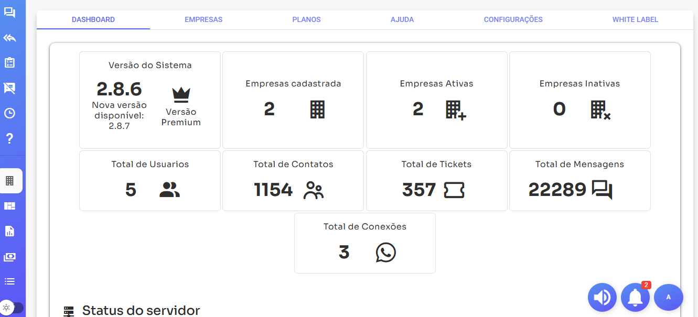
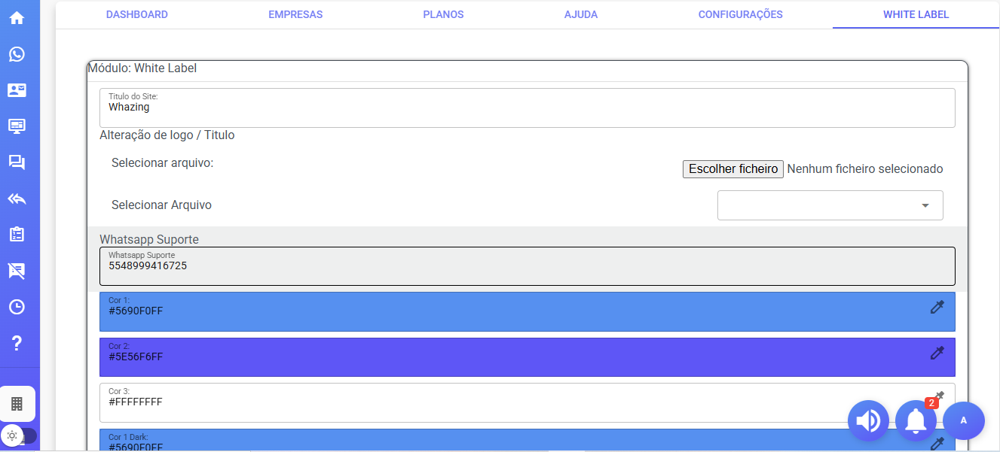
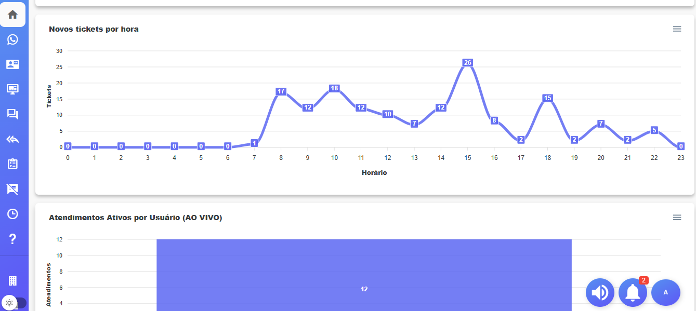

# Whazing SaaS

Um sistema para gestão de atendimento multicanais centralizado.

[](https://chat.whatsapp.com/KAk11eaAfRu6Bp13wQX6MB)

Novos recursos
- Painel SaaS
- Chat Interno
- Solicitar teste na pagina de login, e função esqueci a senha
- Planos
- Menu Ajuda
- Integração bancaria(mercado pago, assas, EFI, Stripe) recebimento PIX, cartão e boleto verificar docs
- Integração WebHook/N8N - TypeBot - Groq - ChatGPT (função exclusiva versão premium)
- Suporte facebook e instagram  e WebChat via hub (função exclusiva versão premium)
- KANBAN (função exclusiva versão premium)
- [Mais informações de recursos](docs/recursos.md)

Dados de Acesso

admin@admin.com
123456

Caso apresente algum bug abra um Issues com maximo de detalhes possiveis

**IMPORTANTE**: 

- [Termos de USO](docs/TermosdeUso.md)

- [Contrato de Licença](docs/contratodelicenca.md)


Versão grátis*

- Limites da versão grátis 
- 10 usuários
- 2 canais
- Somente suporte WhatsApp Api Bayles
- Verificar premium abaixo para saber diferenças

Versão Premium*

- Não possui limites
- Suporte facebook e instagram via HUB
- Kanban
- Integração WebHook/N8N - TypeBot - Groq - ChatGPT
- Transcrição de audio
- Tarefas
- Avaliação de atendimento
- Geração PDF atendimento
- Relatorio de tickets
- Anotações em tickets
- Mensagens separadas por filas
- Transferir atendimento para ChatBot
- Retirada mensagem "Enviado via Whazing" no modulo campanhas

-  [Tabela de Valores versão premium e serviço de instalação](docs/TabeladeValores.md)

## Screenshots
> 

>

>

>

>

>


## Demo do produto

-  [https://teste.whazing.com.br/](https://teste.whazing.com.br/)

- usuario: admin@admin.com
- senha: 123456

## Como instalar

-  [Demonstração basica e Instalação](https://www.youtube.com/watch?v=RMztcAwRjxQ)

-  [Instalação](https://youtu.be/3vsXNyGxo58?si=sjnyqHtKgyfSJX7_)

## Manual feito por um cliente da prataforma

-  [Manual](https://ajuda.super-zapp.com.br/)

## Videos gravador por um cliente da prataforma

-  [Videos](https://www.youtube.com/@ZAPPRO-z4i/videos)
 
## Instalando
Seguem links sugerimos:

-  [Como Instalar o Whazing VPS - Texto - UBUNTU 20, 22](docs/INSTALL_VPS_UBUNTU_20_22.md)

-  [Instalador automatico](https://github.com/cleitonme/Whazing-SaaS.instalador)
<br/>


## Recomendação de VPS boa e barata

-  [Powerful cloud VPS & Web hosting.](https://control.peramix.com/?affid=58)

- Cupom 25% desconto "WHAZING"

```bash
WHAZING
```

#### Curtiu? Apoie o projeto!! Com sua doação, será possível continuar com as atualizações. Segue QR code (PIX)  

[](donate.jpg)

## Adquirir Versão Premium
Para adquirir a versao premium 48 999416725
