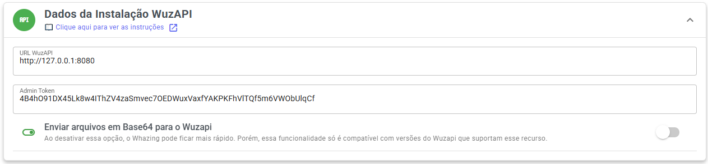

# WhatsApp Wuzapi (WhatsMeow)

## WhatsApp Wuzapi (WhatsMeow)

A **Wuzapi (WhatsMeow)** é recomendada no lugar da **Baileys**, pois é **mais leve**, **estável** e **garante melhor desempenho do sistema**.

***

#### 🧩 **Instalação ou atualização do servidor**

Para instalar ou atualizar, basta executar o comando abaixo:

```bash
curl -sSL wuzapi.whazing.com.br | sudo bash
```

Após a instalação, será exibida uma tela parecida com esta:

```
==============================
✅ Instalação concluída!
URL WuzAPI: http://127.0.0.1:8080
Admin Token: xeU2d47fSHxIM5pSdB4ua9C1y3E4k2
DB Password: vuzNRCFFxp2EqIr
Arquivo: /home/deploy/wuzapi.yaml
==============================
```

***

#### ⚙️ **Conexão no painel Whazing**

<figure><figcaption></figcaption></figure>

1. Acesse o painel **Whazing → SaaS → Canais**
2. Preencha os campos com:
   * **URL:** a exibida na instalação (exemplo: `http://127.0.0.1:8080`)
   * **Admin Token:** o token gerado (exemplo: `xeU2d47fSHxIM5pSdB4ua9C1y3E4k2`)

💡 É possível **migrar entre as 3 APIs não oficiais** — **Baileys**, **API Plus** e **WuzAPI** — **sem perder dados**.

* Desativar "Enviar arquivos em Base64 para o Wuzapi" tornar envio mais rápido pois elimina necessidade de converter base64 arquivos antes de enviar. Mas somente funciona com nossa versão wuzapi a partir 1.0.9 - caso esteja versão mais antiga ou versão original wuzapi deixe ativado

***

#### 🔁 **Reiniciar serviços**

**Reiniciar WuzAPI**

```bash
docker container restart wuzapi
```

**Reiniciar Banco**

```bash
docker container restart postgreswuzapi
```

**Reiniciar RabbitMQ**

```bash
docker container restart rabbitmqwuzapi
```

***

#### 📜 **Ver logs dos contêineres**

**Logs do WuzAPI**

```bash
docker logs --tail 100 -f wuzapi
```

**Logs do Banco**

```bash
docker logs --tail 100 -f postgreswuzapi
```

**Logs do RabbitMQ**

```bash
docker logs --tail 100 -f rabbitmqwuzapi
```

Segue versão melhorada para **GitBook**, mais organizada, com correção de digitação, melhor explicação e mantendo seu conteúdo técnico intacto:

***

## 🗑️ Desinstalar WUZAPI

Caso ocorra algum erro e você precise realizar uma **reinstalação limpa**, ou caso não utilize mais o WUZAPI, siga os passos abaixo para remover completamente a instalação.

> ⚠️ **Importante:** As mensagens já existentes no **Whazing** **não serão perdidas**, pois ficam armazenadas no banco principal do sistema.
>
> Se for instalar novamente, será necessário:
>
> * Ler novamente os **QR Codes**
> * Atualizar o **Token no painel SaaS**

***

### 📂 1️⃣ Acessar diretório de instalação

```bash
cd /home/deploy
```

***

### 🛑 2️⃣ Derrubar containers + remover volumes

Esse comando remove:

* Containers
* Volumes
* Containers órfãos

```bash
docker compose -f wuzapi.yaml down -v --remove-orphans
```

***

### 🔎 3️⃣ Garantir que não restou nenhum container

Verifique se ainda existe algum container ativo ou parado:

```bash
docker ps -a
```

Se ainda aparecer algum container do WUZAPI, remova manualmente:

```bash
docker rm -f wuzapi postgreswuzapi rabbitmqwuzapi
```

***

### 🌐 4️⃣ Limpar redes órfãs

```bash
docker network prune -f
```

***

### 🗂️ 5️⃣ Remover arquivo de configuração

```bash
rm wuzapi.yaml
```

***

### ✅ Finalização

Após esses passos, o WUZAPI estará completamente removido do servidor.
