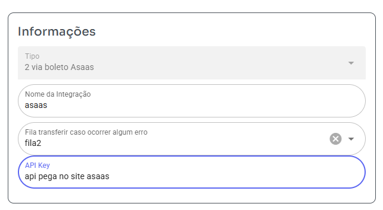
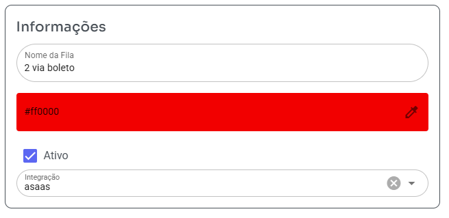
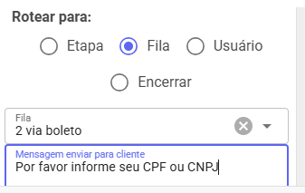

## Guia rapido 2 via boleto asaas no bot

- Acesse configurações - integrações - clique adicionar e preencha

>

- Api key você deve pegar no site https://www.asaas.com/customerApiAccessToken/index

- Acesse Cadastros - Filas - clique adicionar e preencha

>

- Na integração vai selecionar a que você criou na tela anterior

- Agora você cria um chatbot, verificar documentação exemplo como se cria.

>

- Nas confições você vai colocar rotear para fila escolher fila criada anteriormente e mensagem colocar uma solicitando cpf ou cnpj do cliente