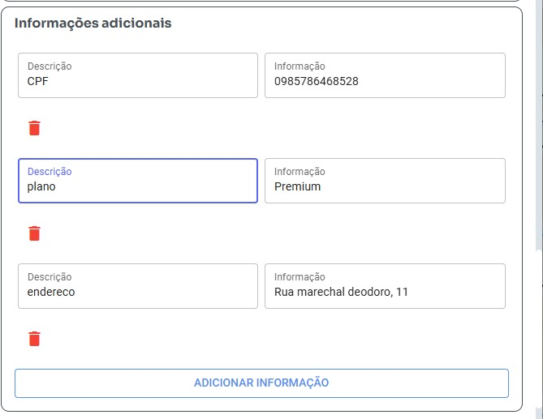
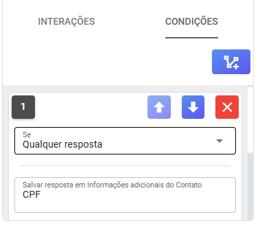

## Tags variáveis Sistema – tela de atendimento

## variáveis Dinamicas

- As variaveis dinamicas usa os dados das Informações adicionais dos Contatos

Exemplo

>

Usando valor abaixo retorna "0985786468528"
```bash
{{CPF}}
```

Usando valor abaixo retorna "Premium"
```bash
{{plano}}
```

Usando valor abaixo retorna "Rua marechal deodoro, 11"
```bash
{{endereco}}
```

Exemplo de uso:

Por favor confirme se seu endereço é {{endereço}}?
1 - Sim
2 - Não

O bot vai enviar:

Por favor confirme se seu endereço é Rua marechal deodoro, 11?
1 - Sim
2 - Não

## Alterar variáveis Dinamicas pelo chatbot

>

- No chatbot tem opção salvar resposta cliente

- Tem arquivo exemplo_fluxo_usando_novas_variaveis.json disponivel com modelo de uso das variaveis dinamicas

-  [Fluxo de exemplo](exemplo_fluxo_usando_novas_variaveis.json)

## variáveis Fixas
primeiro nome do contato
```bash
{{firstName}}
```
nome completo do contato
```bash
{{name}}
```
número do contato
```bash
{{phoneNumber}}
```
e-mail do contato
```bash
{{email}}
```
Saudação
```bash
{{gretting}}
```
id do Ticket
```bash
{{ticket_id}}
```
Saudação
```bash
{{ms}}
```
protocolo
```bash
{{protocol}}
```
hora
```bash
{{hour}}
```
data
```bash
{{date}}
```
Fila 
```bash
{{fila}}
```
e-mail do usuário
```bash
{{userEmail}}
```
nome do usuário
```bash
{{user}}
```

## Variveis Sistema - campanhas

```bash
{{firstName}}
```
```bash
{{name}}
```
```bash
{{phoneNumber}}
```
```bash
{{email}}
```

## Variveis TypeBOT

```bash
number
```
```bash
pushName
```
```bash
nome
```
```bash
email
```
```bash
ticketId
```
```bash
protocol
```
```bash
ticket
```
```bash
remoteJid
```

