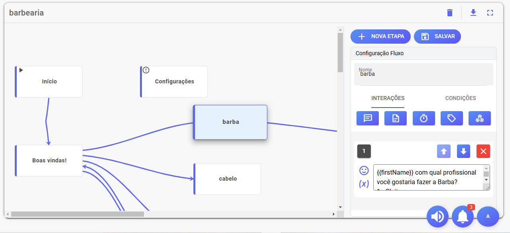
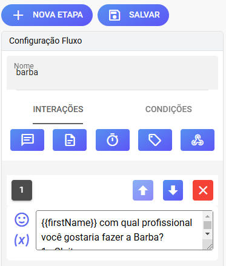
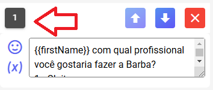
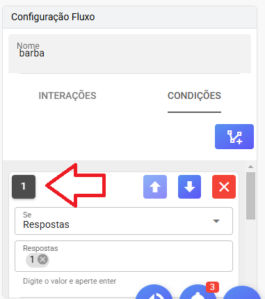
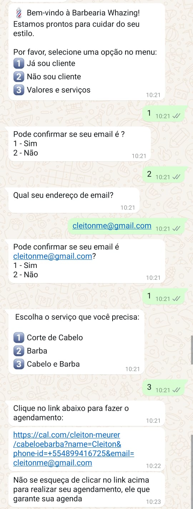

## Breve resumo algumas configurações chatbot interno

>

- Configuração fluxo

>

- Interações na versão 2.8.4 temos atualmente "Enviar Mensagem", "Enviar documentos, vídeo, aúdio e outros arquivos", "Adicionar Delay", "Adicionar Tag", "Adicionar Webhook (GET)".

- Enviar Mensagem - Aqui você coloca texto quer ser enviado no cliente, possivel usar tambem variavel vericar documentação.

- Enviar documentos, vídeo, aúdio e outros arquivos. - Envio de arquivos

- Adicionar Delay - Colocar tempo em segundos entre mensagens

- Adicionar Tag - Marcar uma etiqueta no contato

- Adicionar Webhook (GET) - Enviar informações para um sistema externo por exemplo variaveis capturadas no atendimento.

>

- Esse numero ordem que será executado as interações configurada acimas. Quando for enviar mais de uma mensagem coloque um delay entre elas para garantir que saia na ordem.

>

- Na tela condições acontece mesmo coisa esse prioridade da condição. Exemplo se você colocar condição "Qualquer resposta" ela não vai executar o que tiver abaixo dela. Esse tipo condição sempre se deixa por ultimo.

- Qualquer resposta - Qualquer resposta do cliente executa essa condição - lembre-se da prioridade deixe sempre ela por ultimo

- Respostas - essa tem ser resposta exata exemplo se fosse colocar "1", caso cliente escrever "quero 1" a condição não sera executada tem que ser exatamente "1". Pode colocar mais opções exemplo "1" e "01" então executando caso cliente escreve 1 ou 01

- Contem exato - Essa pode ser palavra dentro frase. Exemplo cadastra "quero comprar" caso receber mensagem "Eu quero comprar um tenis" a condição sera executada

- Contem - Essa vale meio da palavra tambem exemplo se cadastrar "compra" caso receber mensagens "estou comprando" ou "eu sou comprador" a condição vai ser acionada então deve ser usada bastante atenção.

- Dentro do Horário de Atendimento - Executa essa condição dentro horario atendimento - lembre-se da prioridade deixe ela sempre no começo

- Fora do Horário de Atendimento - Executa essa condição fora horario atendimento - lembre-se da prioridade deixe ela sempre no começo

## Exemplos de fluxos para chat interno

## Fluxo que muda pelo horario de atendimento

- Esse fluxo simula empresa de seguros tem que ter um plantão para emergencias

>

>

-  [Fluxo de exemplo](horario_de_atendimento.json)

## Fluxo com uso variaveis dinamicas

- Nesse fluxo você pode fazer pergunta cliente e guardar uma variavel usar depois

-  [Fluxo de exemplo](exemplo_fluxo_usando_novas_variaveis.json)

Exemplo de uso:

Por favor confirme se seu endereço é {{endereço}}?
1 - Sim
2 - Não

O bot vai enviar:

Por favor confirme se seu endereço é Rua marechal deodoro, 11?
1 - Sim
2 - Não

## Fluxo para agendamento com cal.com

- Exemplo fluxo envia link https://cal.com/ para fazer agendamentos

-  [Fluxo de exemplo](agendamentobarbearia.json)

>