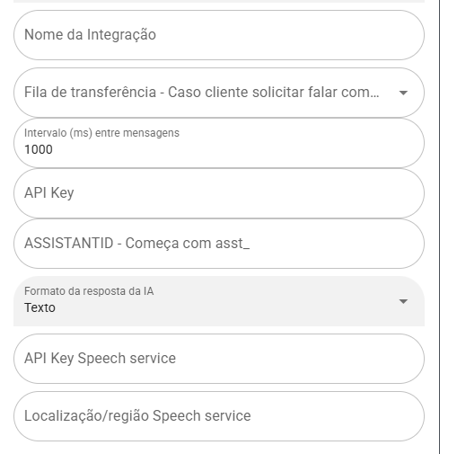
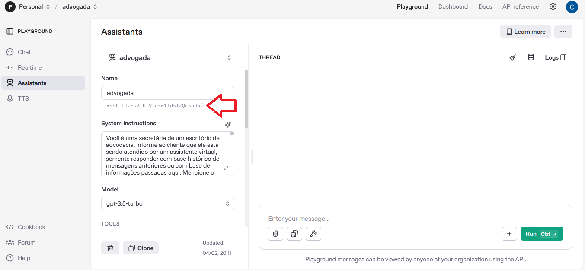

## ChatGPT Assistant

- Por que escolher essa integração?
- Você vai conseguir uma IA bem mais ajustada para obter melhor resultado

## Alguns videos falando desse modelo de configuração

https://www.youtube.com/watch?v=N2Ynpl16o4I

https://www.youtube.com/watch?v=3A4rdBnCJPA

## Configurar ChatGPT Assistant

>

- Fila - Selecione a fila que ia deve transferir caso ela não consiga responder as perguntas ou resolver o problema
- Intervalor (ms) entre mensagens - Tempo entre resposta da IA 1000ms = 1S
- API Key - Api conexão com IA - Lembrando ChatGpt paga por Token - https://platform.openai.com/settings/organization/api-keys

- ASSISTANTID - Começa com asst_ - Identificação do assistant - https://platform.openai.com/playground/assistants

- Ao criar assistent Response format deve ser text

>

- Formato da resposta da IA - Caso seja seleciona valor diferente de texto, tem que ter conta "Microsoft Azure Text-to-Speech" configurada nos proximos campos
- API Key Speech service - Necessario caso campo acima seja diferente texto - Abaixo manual como obter dados
- Localização/região Speech service - Necessario caso campo acima seja diferente texto - Abaixo manual como obter dados

# How to get Microsoft Azure Text-to-Speech API key

https://docs.merkulov.design/how-to-get-microsoft-azure-tts-api-key/