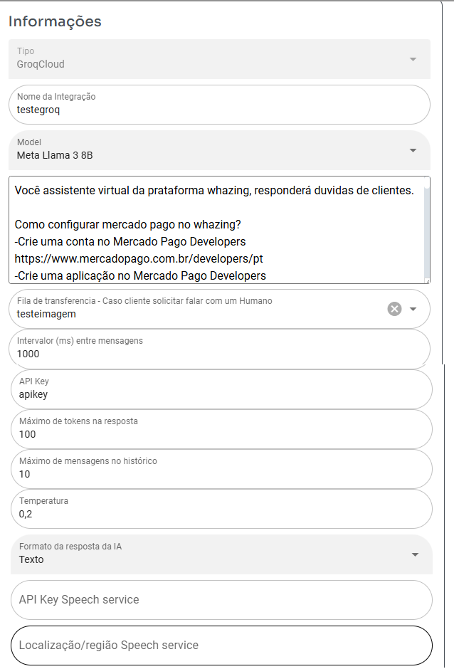

## Configurar Groq ou ChatGPT

>

- Model - Modelo da linguagem
- Prompt - Ali onde você instrui como a IA deve atender o cliente e agir
- Fila - Selecione a fila que ia deve transferir caso ela não consiga responder as perguntas ou resolver o problema
- Intervalor (ms) entre mensagens - Tempo entre resposta da IA 1000ms = 1S
- API Key - Api conexão com IA - Lembrando ChatGpt paga por Token
- Máximo de tokens na resposta - Influencia no tamanho da resposta, Lembrando ChatGpt paga por Token
- Máximo de mensagens no histórico - Numero mensagens que ia vai consultar para montar reposta (somente consulta mensagens do mesmo ticket, valor muito alto pode fazer ia travar, ChatGPt cobra token então historico muito alto faz cobrança ficar mais alta tambem)
- Temperatura - Controla criatividade da IA quanto maior valor mais chance da ia sair do roteiro, Pode ser usado valores quebrados exemplo 0,2 ou 1,5
- Formato da resposta da IA - Caso seja seleciona valor diferente de texto, tem que ter conta "Microsoft Azure Text-to-Speech" configurada nos proximos campos
- API Key Speech service - Necessario caso campo acima seja diferente texto - Abaixo manual como obter dados
- Localização/região Speech service - Necessario caso campo acima seja diferente texto - Abaixo manual como obter dados

# How to get Microsoft Azure Text-to-Speech API key

https://docs.merkulov.design/how-to-get-microsoft-azure-tts-api-key/