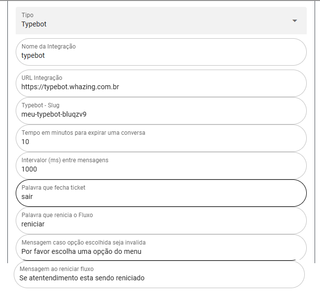
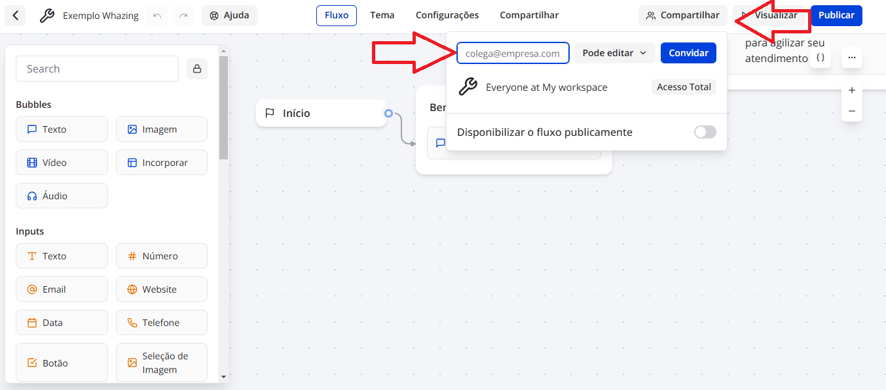

## Configurar Typebot 

>

>

- URL Integração - Pegar Url na publicação typebot não colocar ultima / conforme exemplo acima
- Typebot - Slug - Nome aparece depois no final quando publica olhar exemplo acima
- Tempo em minutos para expirar uma conversa - Tempo de inatividade que leva para whazing se desconectar typebot caso não tenha mais interação do cliente
- Intervalor (ms) entre mensagens - Tempo entre resposta da IA 1000ms = 1S
- Palavra que fecha ticket - Comando cliente envia que faz ticket ser fechado
- Palavra que renicia o Fluxo - Comando cliente enviar de volta para começo do fluxo do typebot
- Mensagem caso opção escolhida seja invalida - Mensagem bot vai enviar caso não receber mensagem esperada - Exemplo usou input numero e cliente enviou texto
- Mensagem ao reniciar fluxo - Mensagem que será enviada apos comando renicia o fluxo

# Variveis TypeBOT

number

pushName

nome

email

ticketId

protocol

ticket

remoteJid

- Comandos possiveis - colocar Bubble texto e colocar comando abaixo

- Comando para transferir de Fila (lembre-se de trocar o ID)
#{ "queueId": "1" }
- Comando para transferir para Atendente (lembre-se de trocar o ID)
#{ "queueId":"1", "userId":"1" }
- Parar o TypeBot (não precisa trocar o 1)
#{ "stopBot":"1" }
- Comando para adicionar uma Etiqueta (lembre-se de trocar o ID)
#{ "tagId": "1" }
- Comando para finalizar o atendimento (não precisa trocar o 1)
#{ "closeTicket":"1" }

- Os ids podem ser pego na tela lista os cadastros no whazing

**IMPORTANTE**: 

- [Como instalar typebot mesma VPS WHAZING](Comoinstalar.md)

# Exemplo fluxo para baixar abaixo e importar no typebot

- [Exemplo de fluxo typebot compativel com whazing](exemplo-fluxo-typebot.json)

# Como compartilhar fluxo com cliente

>
