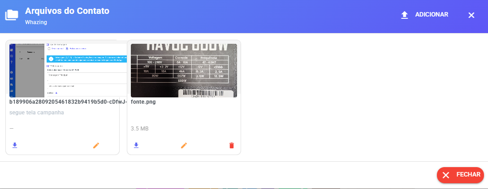
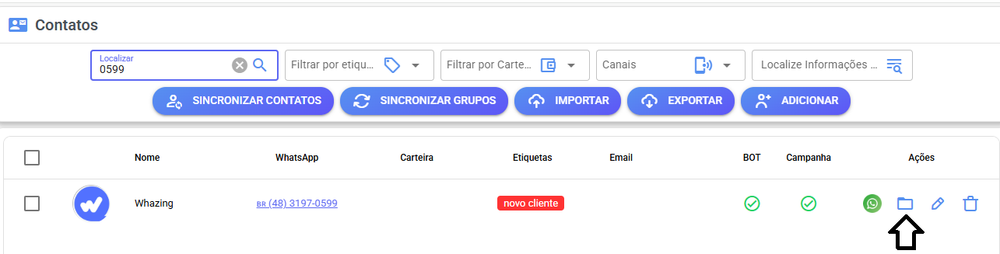
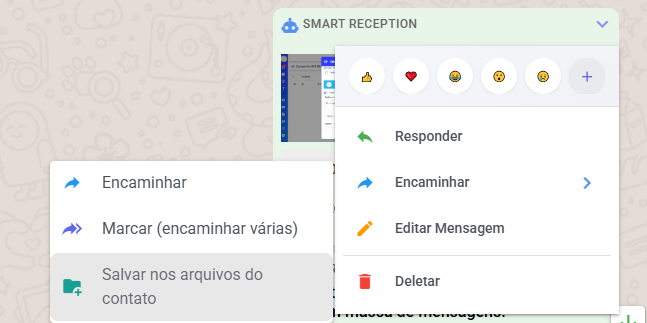

# Arquivos do Contato

No sistema, você pode **salvar arquivos diretamente em um contato** para ter acesso rápido sempre que precisar.

Isso é útil para guardar documentos, imagens, áudios ou qualquer arquivo importante relacionado ao cliente.

#### 📍 Onde acessar os arquivos do contato

<figure><figcaption></figcaption></figure>

Os arquivos ficam disponíveis em vários pontos do sistema:

* Na **lista de contatos** (ícone específico 📎)

<figure><figcaption></figcaption></figure>

* Na **tela Kanban**

<figure><figcaption></figcaption></figure>

* Na **tela de atendimento**, na seção **"Dados do contato"**

***

#### ➕ Como adicionar arquivos ao contato

Você pode salvar arquivos de duas formas simples:

**1. Pelo modal de arquivos**

* Abra o modal de arquivos do contato
* Você verá a lista de arquivos já salvos
* Basta adicionar novos arquivos diretamente por ali

**2. Pela tela de atendimento**

* Durante uma conversa, localize a mensagem com o arquivo
* Clique na **seta para baixo (⬇️)** da mensagem
* Selecione a opção **"Salvar nos arquivos do contato"**

<figure><figcaption></figcaption></figure>

✅ Funciona tanto para:

* Arquivos **enviados**
* Arquivos **recebidos**

***

#### 💡 Dica

Salvar arquivos no contato facilita muito o dia a dia, evitando ter que procurar mensagens antigas para encontrar documentos importantes.
