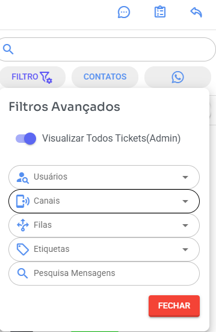

# Organização de Atendimentos, Filas e Permissões de Usuários

#### Como administrador ver todos atendimentos 

<figure><figcaption></figcaption></figure>

Clique em filtro e marque "Visualizar Todos Tickets(Admin)" não marque mais nada

Para saber como alterar permissões usuários verifique

[algumas-permissoes-usuarios.md](usuarios/algumas-permissoes-usuarios.md "mention")

#### 🧠 Conceito Principal (Muito Importante) 

✅ **Quem separa e organiza os atendimentos são as FILAS.** ❌ Os canais (WhatsApp, Instagram, Facebook etc.) NÃO separam atendimentos.

Os canais apenas recebem as mensagens.

As filas determinam:

* Quem pode visualizar o atendimento
* Quem pode responder
* Quem pode transferir
* Quem tem acesso ao histórico
* Quem NÃO pode ver determinada conversa

***

#### 📲 O que são Canais? 

Canais são os meios de entrada de mensagens, como:

* WhatsApp
* Instagram
* Facebook

Eles apenas recebem ou iniciam conversas.

A organização interna é feita pelas **filas**.

***

#### 📂 O que são Filas? 

Filas funcionam como departamentos ou setores da empresa.

Exemplos práticos:

* 📦 Suporte
* 💰 Financeiro
* 🛒 Vendas
* 📲 WhatsApp Loja 1
* 📲 WhatsApp Loja 2
* 🚚 Pós-venda

Cada usuário só poderá visualizar as conversas das filas às quais ele pertence.

Atendimentos sem fila somente admin e supervisor geral tem acesso

***

#### 🛠 Como separar atendimentos corretamente 

Você pode direcionar atendimentos para filas de duas formas:

***

**✅ 1️⃣ Definindo fila no cadastro do Canal**

No cadastro do canal (WhatsApp, Instagram etc.) você pode definir uma **fila padrão**.

**📌 Exemplo prático:**

Você possui um WhatsApp exclusivo do Financeiro.

Objetivo: Somente o setor Financeiro pode visualizar as conversas desse número.

**Passo a passo:**

1. Criar uma fila chamada **Financeiro**
2. Adicionar apenas usuários do financeiro nessa fila
3. No cadastro do canal (WhatsApp Financeiro), definir a fila padrão como **Financeiro**

**Resultado:**

* Todos os novos atendimentos desse canal entrarão automaticamente na fila Financeiro
* Apenas usuários dessa fila poderão visualizar
* Outros usuários nem verão esses tickets na lista

Isso garante total controle e privacidade do setor.

***

**✅ 2️⃣ Direcionando fila via BOT**

O BOT também pode transferir automaticamente o atendimento para uma fila específica.

**📌 Exemplo:**

Menu automático:

1️⃣ Vendas 2️⃣ Financeiro 3️⃣ Suporte

Se o cliente digitar "2", o sistema pode:

➡ Transferir automaticamente para a fila **Financeiro**

Isso permite organizar o atendimento conforme a escolha do cliente.

***

#### 🔄 Transferência entre Filas 

Quando um atendimento é transferido para outra fila:

* Apenas usuários da nova fila terão acesso
* Usuários que não pertencem à nova fila perderão a visualização

***

#### ⚙️ Configurações Gerais que Afetam a Visualização 

No menu **Configurações Gerais**, existem opções importantes que influenciam o comportamento dos tickets. Para alterar acesse Configurações - Configurações

***

**🔒 Não visualizar tickets privados atribuídos a outros usuários**

Se ativado:

* Quando um usuário estiver atendendo um ticket
* Outros usuários NÃO poderão acessar esse atendimento

Ideal para evitar interferência ou duplicidade de resposta.

**📌 Exemplo:**

João está atendendo um cliente. Se essa opção estiver ativa: Maria não conseguirá abrir esse mesmo atendimento.

***

**👁 Visualizar apenas mensagens das filas que o usuário pertence**

Se ativado:

* O usuário só verá mensagens das filas às quais pertence
* Caso o ticket seja transferido, ele poderá perder acesso ao histórico anterior

**📌 Exemplo prático:**

1. Atendimento começou na fila **Vendas**
2. Depois foi transferido para **Suporte**
3. Usuário do Suporte NÃO faz parte da fila Vendas
4. Ele verá apenas as mensagens a partir da transferência
5. Não terá acesso ao histórico anterior

Essa configuração aumenta a segmentação e segurança das informações.

***

#### 🔐 Exemplo Completo de Cenário Real 

Empresa possui:

* WhatsApp Vendas
* WhatsApp Suporte
* WhatsApp Financeiro

Criação de filas:

* Fila Vendas
* Fila Suporte
* Fila Financeiro

Configuração:

WhatsApp Vendas → Fila Vendas WhatsApp Suporte → Fila Suporte WhatsApp Financeiro → Fila Financeiro

Usuário João:

* Acesso à fila Vendas

Usuária Maria:

* Acesso à fila Suporte

Usuário Carlos:

* Acesso à fila Financeiro

Resultado:

João só vê Vendas Maria só vê Suporte Carlos só vê Financeiro

Mesmo que todos tenham acesso ao sistema, cada um verá apenas o que é permitido.

***

#### 🧾 Resumo Final 

* 📲 Canais recebem mensagens
* 📂 Filas organizam e separam atendimentos
* 👤 Usuários só veem filas que têm acesso
* 🔄 Transferências mudam permissões de visualização
* ⚙ Configurações Gerais podem restringir ainda mais
* 🔒 Tickets podem ser privados
* 🔄 Sempre deslogar e logar após alterar permissões
