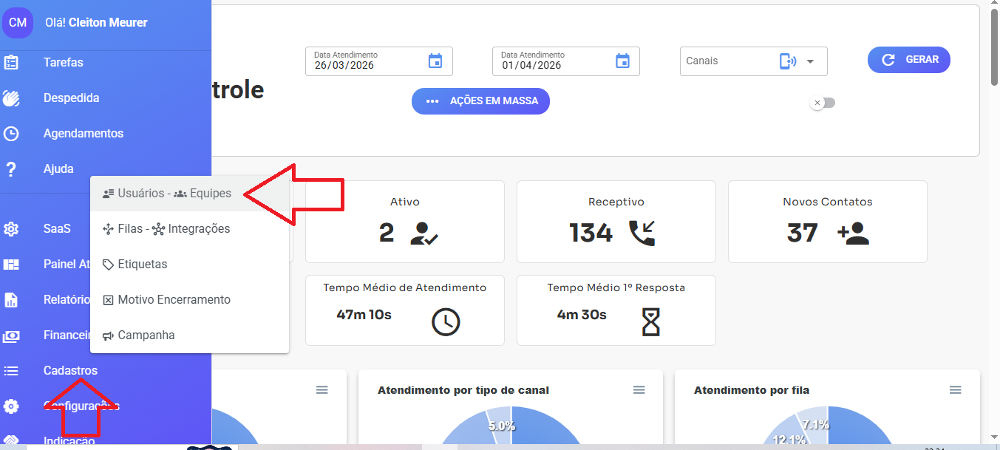
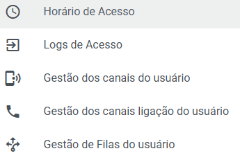

# Algumas permissões usuários

<figure><figcaption></figcaption></figure>

Em cadastros - usuários/equipes onde gerenciamos os usuários do sistema. podemos dar permissões para os mesmos. Clicando 3 pontinhos temos seguintes opções

<figure><figcaption></figcaption></figure>

***

**Horário de Acesso** Define os horários em que o usuário pode acessar o sistema, evitando acessos fora do expediente por colaboradores.

**Logs de Acesso** Registra todos os acessos realizados pelos usuários no sistema, permitindo acompanhamento e auditoria.

**Gestão dos Canais do Usuário** Essa opção define:

* Quais canais o usuário pode usar para:
  * Abrir um ticket manualmente
  * Agendar mensagens

⚠ Importante:

Se o usuário não tiver nenhum canal definido, aparecerá a mensagem:

_"_&#x4E;enhum canal disponível: sem permissão de acesso ou canal desconectado._"_

📌 Atenção:

Essa configuração NÃO separa atendimentos.

Quem separa são as **filas**.

Ela apenas permite iniciar conversas manualmente.

**Gestão dos Canais de Ligação do Usuário**

Se estiver utilizando Wavoip: Você pode definir quais usuários poderão: Iniciar chamadas Receber chamadas Sem essa permissão, o usuário não terá acesso às funcionalidades de chamada..

**Gestão de Filas do Usuário**

Aqui você define quais filas o usuário pode acessar.

Essa é a configuração mais importante para controle de visualização.

Se o usuário não estiver em uma fila:

* Ele não verá os atendimentos dessa fila
* Não poderá responder
* Não poderá transferir

⚠ Muito importante:

Sempre que alterar as filas de um usuário:

➡ É obrigatório deslogar e logar novamente Caso contrário, as permissões podem não atualizar corretamente.

✅ **Importante:** Quem organiza e separa os atendimentos no sistema são as **FILAS**
