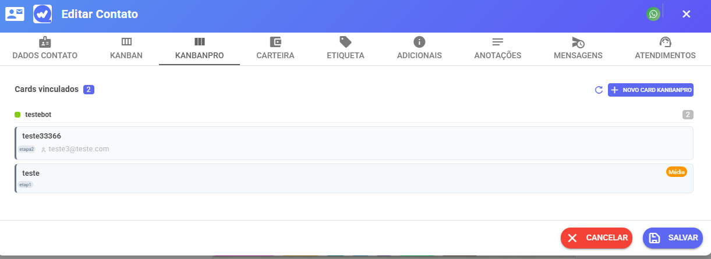

# Cards nos Atendimentos

O KanbanPro aparece em dois lugares dentro dos atendimentos, permitindo gerenciar cards sem sair do chat.

***

### Painel lateral

No painel de informações do atendimento, existe uma seção **Kanban Pro** que mostra todos os cards vinculados ao contato daquele ticket.

<figure><figcaption></figcaption></figure>

**O que você pode fazer:**

* Ver todos os cards do contato
* Clicar no título para abrir o modal completo do card
* **Mover o card de etapa** direto pelo seletor inline — sem precisar abrir o modal
* Criar um novo card clicando em **Vincular etapa**

***

### Aba de contato

No perfil do contato, há uma aba específica do Kanban Pro mostrando todos os cards daquele contato agrupados por quadro.

<figure><figcaption></figcaption></figure>

**O que você pode fazer:**

* Ver cards organizados por quadro
* Filtrar por prioridade e data via chip de informações
* Criar um novo card com **+ Novo Card**
* Abrir o modal completo de qualquer card

***

### Criar card a partir do atendimento

1. Clique em **Vincular etapa** (painel lateral) ou **+ Novo Card** (aba do contato)
2. Selecione o quadro — as etapas carregam automaticamente
3. Selecione a etapa de destino
4. Dê um título ao card
5. Clique em **Criar card**

O contato já é vinculado automaticamente ao card criado.
