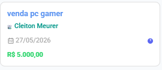
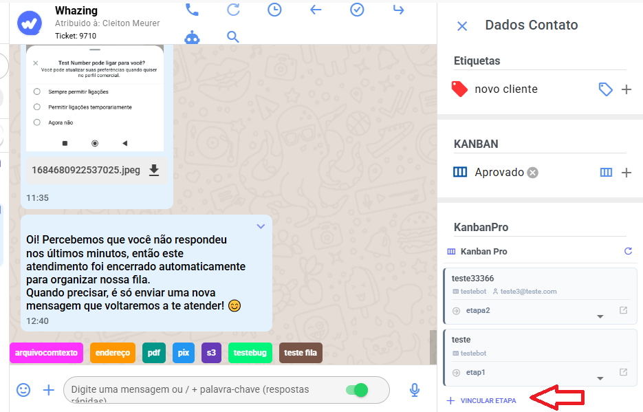
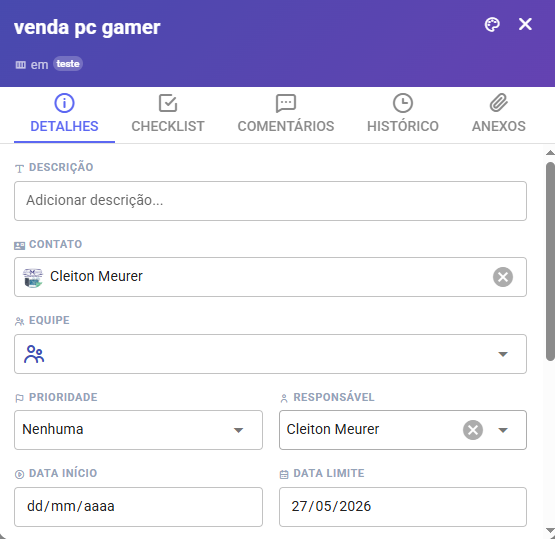
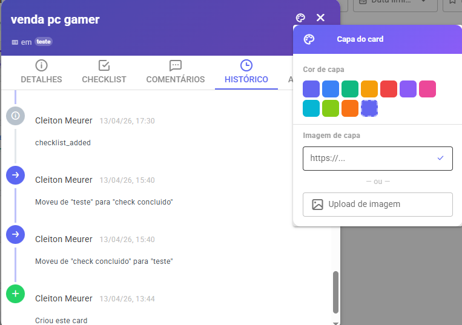

# Cards

Um **card** representa um item do seu processo — pode ser um lead, um atendimento, uma tarefa ou qualquer coisa que você queira acompanhar.

<figure><figcaption></figcaption></figure>

### Criar um card

**Pelo quadro:**

1. Clique em **+ Adicionar card** no rodapé de qualquer coluna
2. Digite o título e pressione Enter

**Pelo painel rápido (dentro de um atendimento):**

1. No chat do atendimento, localize o painel KanbanPro no menu abre no lado direito
2. Clique em **Vincular etapa**
3. Escolha o quadro, a etapa e dê um título ao card

<figure><figcaption></figcaption></figure>

### Informações do card

Ao abrir um card (clique no título), você vê 5 abas:

#### Aba Detalhes

| Campo                             | Descrição                                              |
| --------------------------------- | ------------------------------------------------------ |
| **Título**                        | Nome do card, editável pelo próprio campo no cabeçalho |
| **Descrição**                     | Texto livre, salvo ao sair do campo                    |
| **Contato**                       | Vincula um contato da plataforma ao card               |
| **Equipe**                        | Vincula uma equipe interna                             |
| **Prioridade**                    | Urgente, Alta, Média, Baixa ou Nenhuma                 |
| **Responsável**                   | Usuário da plataforma que cuida do card                |
| **Data de início**                | Quando o trabalho começa                               |
| **Data limite**                   | Prazo final — cards vencidos ficam em vermelho         |
| **Rótulos**                       | Tags coloridas para categorizar                        |
| **Horas estimadas / registradas** | Para controle de tempo                                 |
| **Valor de negociação**           | Valor monetário da oportunidade                        |
| **Campos personalizados**         | Campos extras que você criar                           |

<figure><figcaption></figcaption></figure>

#### Aba Checklist

Crie uma lista de tarefas dentro do card. Cada item pode ter:

* **Texto** — clique para editar inline
* **Responsável** — atribua um usuário da equipe
* **Prazo** — data limite para aquele item

Uma barra de progresso mostra automaticamente o percentual concluído.

#### Aba Comentários

Escreva mensagens internas sobre o card. Você pode:

* Mencionar colegas com **@nome** — eles recebem mensagem no chat interno
* Editar ou deletar seus próprios comentários

#### Aba Histórico

Registro automático de tudo que aconteceu com o card: criação, movimentações, edições, atribuições e comentários. Ideal para auditoria.

<figure><figcaption></figcaption></figure>

#### Aba Anexos

Faça upload de arquivos diretamente no card. Você pode:

* Selecionar um arquivo do computador
* Baixar ou deletar anexos existentes

### Mover um card

**Arrastando:** segure o card e solte em outra coluna. Um diálogo aparece pedindo uma nota opcional sobre o motivo da movimentação — essa nota fica no histórico.

**Pelo menu:** clique no ícone de seta (→) no card para ver a lista de colunas disponíveis.

**Pelo modal:** dentro do card aberto, clique em **Mover card** na aba Detalhes.

### Capa do card

Personalize o card com uma cor de fundo ou imagem de capa — facilita identificar visualmente categorias diferentes no quadro.

Clique no ícone 🎨 no cabeçalho do modal e escolha uma cor ou cole uma URL de imagem.

<figure><figcaption></figcaption></figure>

### Arquivar um card

Cards arquivados saem do quadro mas **não são deletados**. Para arquivar: dentro do card aberto, clique em **Arquivar card** na aba Detalhes.

Para ver e restaurar cards arquivados, clique no ícone 📁 na barra superior do quadro.
