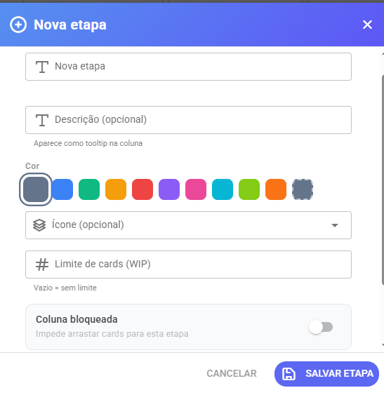
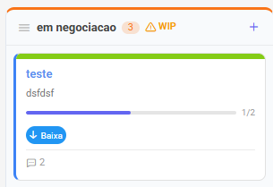

# Etapas (Colunas)

As **etapas** são as colunas do seu quadro — representam as fases do seu processo. Um funil de vendas clássico pode ter etapas como: _Leads → Contato feito → Proposta enviada → Fechado_.

### Criar uma etapa

1. Acesse o quadro desejado
2. Clique no ícone ⚙️ **Gerenciar Etapas** na barra superior
3. Clique em **+ Nova Etapa**
4. Preencha:
   * **Nome** — obrigatório
   * **Descrição** — aparece como tooltip no cabeçalho da coluna
   * **Cor** — identifica visualmente a etapa
   * **Ícone** — opcional
   * **Limite de cards (WIP)** — define quantos cards podem estar nessa etapa simultaneamente
   * **Coluna bloqueada** — impede arrastar cards para essa etapa

<figure><figcaption></figcaption></figure>

### Limite WIP

WIP significa _Work In Progress_ — cards em andamento. Se você definir limite 5 em "Em Negociação", o sistema avisa visualmente quando a coluna atingir esse número.

Isso evita gargalos: a equipe sabe que precisa avançar os cards antes de puxar mais.

<figure><figcaption></figcaption></figure>

### Coluna bloqueada

Uma coluna bloqueada não aceita cards por arrastar. É útil para etapas finais como "Cancelado" ou "Perdido" — o card só chega lá via ação deliberada, não por acidente no drag-and-drop.

### Reordenar etapas

No gerenciador de etapas, arraste as linhas pelo ícone (≡) para reorganizar a ordem das colunas no quadro.

### Deletar uma etapa

Ao deletar uma etapa, os cards que estão nela são **arquivados automaticamente** (não são perdidos). Você pode recuperá-los pela função de cards arquivados.
