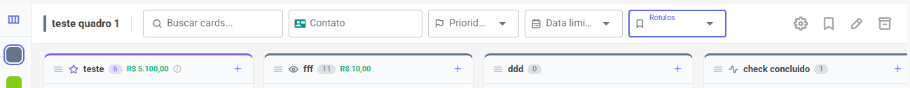

# Filtros e Busca

A barra superior do quadro tem filtros para você encontrar rapidamente o que precisa, especialmente em quadros com muitos cards.

<figure><figcaption></figcaption></figure>

### Filtros disponíveis

| Filtro          | Como funciona                                      |
| --------------- | -------------------------------------------------- |
| **Busca**       | Filtra por texto no título ou descrição do card    |
| **Contato**     | Mostra só cards vinculados a um contato específico |
| **Prioridade**  | Filtra por nível de prioridade                     |
| **Data limite** | Hoje / Esta semana / Este mês / Vencidos           |
| **Rótulos**     | Filtra por rotulo colorida                         |

Os filtros se combinam — você pode buscar, por exemplo, todos os cards de prioridade **Alta** com vencimento **Hoje**.

Para limpar um filtro, clique no X ao lado dele.
