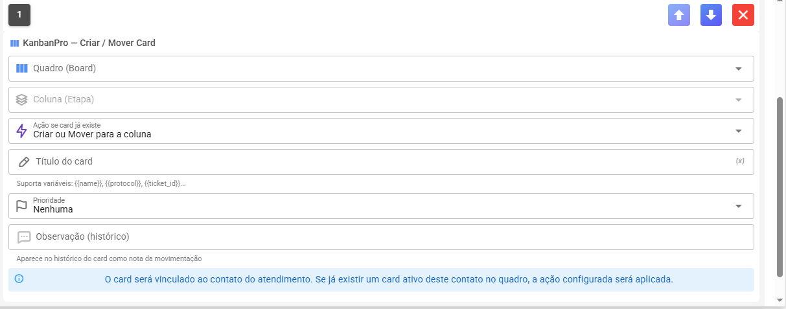

# KanbanPro no Fluxo do Bot

Você pode conectar o KanbanPro ao construtor de fluxos ChatBot Interno para criar e mover cards **automaticamente** conforme o contato avança pelo bot.

<figure><figcaption></figcaption></figure>

### Como adicionar

No ChatBot, adicione nas interaçdo tipo **KanbanPro**. Configure:

* **Quadro** — em qual quadro o card será criado/movido
* **Coluna** — a etapa de destino
* **Ação** — o comportamento quando o contato chega nesse nó (veja abaixo)
* **Título do card** — suporta variáveis como `{{name}}`, `{{phoneNumber}}`, `{{protocol}}`
* **Prioridade** — prioridade padrão do card criado
* **Observação** — texto que vai para o histórico do card

### Variáveis disponíveis no título

| Variável          | O que insere             |
| ----------------- | ------------------------ |
| `{{name}}`        | Nome completo do contato |
| `{{firstName}}`   | Primeiro nome            |
| `{{protocol}}`    | Número do protocolo      |
| `{{phoneNumber}}` | Telefone do contato      |
| `{{ticket_id}}`   | ID do atendimento        |
| `{{date}}`        | Data atual               |
| `{{fila}}`        | Nome da fila             |

**Exemplo de título:** `Lead — {{name}} — {{date}}`

***

### As 4 ações

O sistema **verifica primeiro** se já existe um card ativo daquele contato no quadro antes de decidir o que fazer.

#### Criar ou Mover para a coluna ← a mais usada

> Se não existe card: **cria** na coluna configurada.\
> Se já existe: **move** para a coluna configurada.

**Caso de uso:** funil de vendas. O card do contato acompanha o progresso conforme ele avança pelo bot.

1ª interação → cria card em "Leads"\
Escolhe produto → move para "Qualificado"\
Confirma interesse → move para "Proposta"

***

#### Criar ou Atualizar dados

> Se não existe card: **cria** na coluna configurada.\
> Se já existe: **atualiza dados** (título, prioridade) mas **não muda de coluna**.

**Caso de uso:** enriquecer o card com novas informações sem alterar onde ele está no funil.

Abre atendimento → cria card "Atendimento — Maria" prioridade Baixa\
Escolhe "Suporte Urgente" → atualiza para prioridade Alta\
Card continua na mesma coluna, só os dados mudaram.

***

#### Sempre criar novo card

> **Sempre cria** um card novo, independente de já existir outro.

**Caso de uso:** cada atendimento é um ticket separado, você quer um card por protocolo, não por contato.

Carlos — ticket #101 → cria card\
Carlos — ticket #102 (nova dúvida) → cria mais um card\
Carlos terá 2 cards simultâneos no quadro.

⚠️ Use com atenção — pode gerar vários cards do mesmo contato.

***

#### Apenas mover (não cria se inexistente)

> Se já existe card: **move** para a coluna configurada.\
> Se não existe: **não faz nada**.

**Caso de uso:** etapas do bot que só fazem sentido para contatos que já estão no funil — não quer criar cards para quem nunca entrou por outro canal.

Pedro — entrou pelo formulário externo, já tem card criado manualmente Pedro interage no bot → move card para "Em Negociação"

Ana — nunca teve card criado Ana chega no mesmo nó → nada acontece

***

### Tabela resumo das ações

| Ação                                   | Sem card existente | Com card existente                |
| -------------------------------------- | ------------------ | --------------------------------- |
| Criar ou Mover para a coluna           | ✅ Cria na coluna   | 🔀 Move para a coluna             |
| Criar ou Atualizar dados               | ✅ Cria na coluna   | ✏️ Atualiza dados, fica onde está |
| Sempre criar novo card                 | ✅ Cria na coluna   | ✅ Cria outro card também          |
| Apenas mover (não cria se inexistente) | ❌ Não faz nada     | 🔀 Move para a coluna             |

> 💡 Para a maioria dos funis de vendas e atendimento, Criar ou Mover para a coluna **é o que você quer**.
