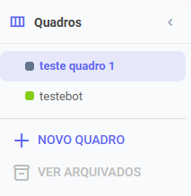
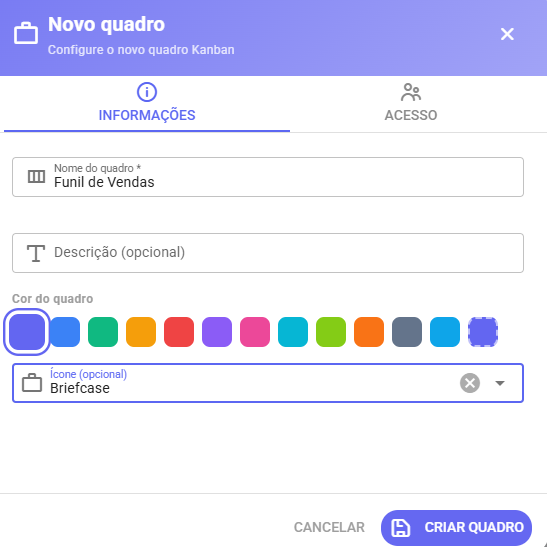

# Quadros

Um **quadro** representa um processo completo. Você pode ter vários quadros — um para vendas, outro para suporte, outro para projetos internos.

<figure><figcaption></figcaption></figure>

### Criar um quadro

1. No menu lateral esquerdo, clique em **+ Novo Quadro**
2. Preencha as informações:
   * **Nome** — obrigatório. Ex: "Funil de Vendas"
   * **Descrição** — opcional, aparece como dica ao passar o mouse
   * **Cor** — escolha nos swatches ou use uma cor personalizada
   * **Ícone** — opcional, aparece junto ao nome na sidebar
3. Clique em **Criar Quadro**

<figure><figcaption></figcaption></figure>

### Definir um quadro padrão

Clique na ⭐ estrela ao lado do quadro. O quadro padrão é aberto automaticamente quando você acessa o KanbanPro.

### Reordenar quadros

Arraste os quadros pelo ícone de três linhas (≡) para reordenar na sidebar.

### Arquivar um quadro

Quadros arquivados ficam ocultos da lista principal mas **não são deletados** — você pode restaurá-los quando precisar.

1. Clique no ícone de arquivo (📁) ao lado do quadro
2. Confirme a ação no diálogo

Para ver quadros arquivados, clique em **Ver arquivados** no final da sidebar.

### Controle de acesso

Na aba **Acesso** do modal de edição do quadro, você define quem pode visualizar e editar.

| Perfil           | O que pode fazer                                     |
| ---------------- | ---------------------------------------------------- |
| **Admin**        | Cria/deleta colunas, arquiva cards, gerencia membros |
| **Editor**       | Cria e move cards, edita informações                 |
| **Visualizador** | Só lê, não pode alterar nada                         |

> ℹ️ Usuários com perfil **admin** ou **supervisor** na plataforma têm acesso automático a todos os quadros, independente da configuração de membros.
