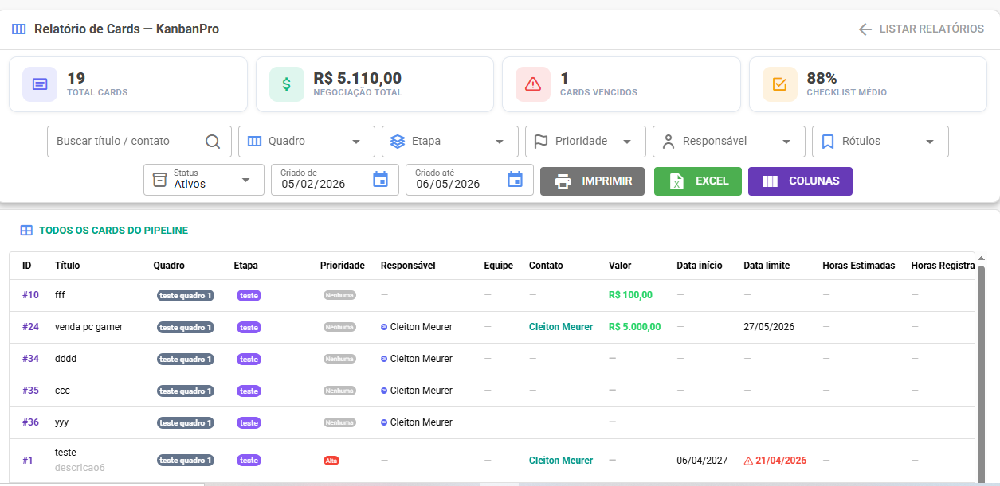
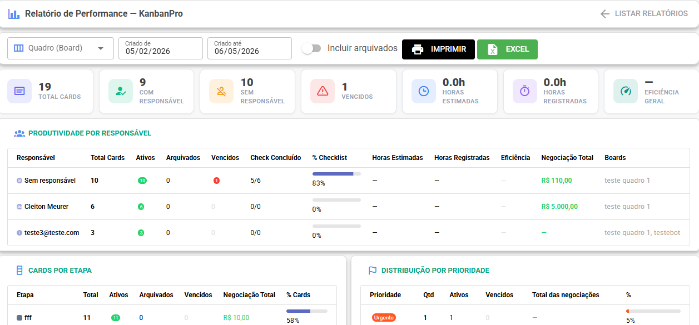
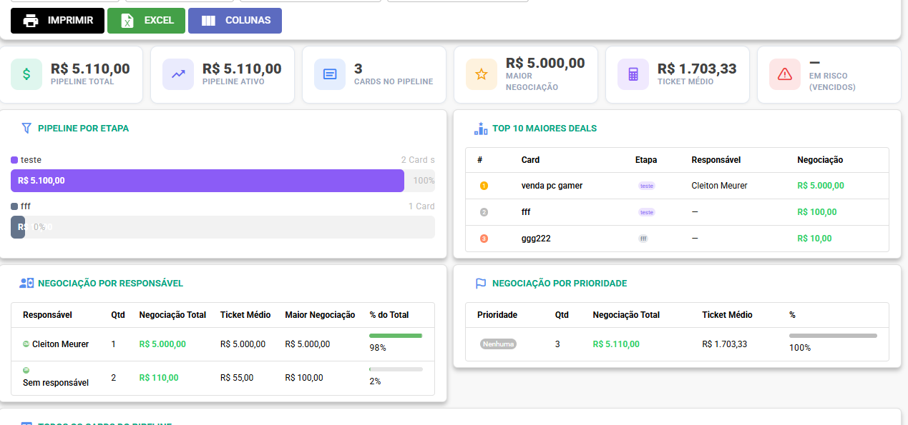

# Relatórios

O Kanban Pro tem três relatórios gerenciais disponíveis para **admin** e **supervisor**.\
Acesse em **Relatórios → KanbanPro**.

***

### Relatório de Cards

Visão geral de todos os cards com filtros avançados e exportação.

<figure><figcaption></figcaption></figure>

**KPIs exibidos:**

* Total de cards
* Valor total de negociações (deal)
* Cards vencidos
* Percentual médio de checklist concluído

**Filtros disponíveis:**

* Busca por título ou contato
* Quadro, etapa, prioridade, responsável, rótulo
* Status (ativos / arquivados / todos)
* Período de criação (data de/até)

**Colunas da tabela** (configuráveis pelo botão "Configurar Colunas"):

ID, Título, Quadro, Etapa, Prioridade, Responsável, Equipe, Contato, Valor, Data início, Data limite, Horas estimadas, Horas registradas, Checklist, Rótulos, Comentários, Anexos, Status, Criado em, Arquivado em.

**Exportar:**

* 🖨️ Imprimir — abre versão formatada para impressão
* 📊 Excel — exporta as colunas visíveis para `.xlsx`

***

### Relatório de Performance

Foco na produtividade da equipe por responsável, etapa e prioridade.

<figure><figcaption></figcaption></figure>

**Por responsável:**

| Coluna                        | Descrição                                                                                    |
| ----------------------------- | -------------------------------------------------------------------------------------------- |
| Total de cards                | Quantos cards estão atribuídos                                                               |
| Ativos / Arquivados           | Distribuição por status                                                                      |
| Vencidos                      | Cards com prazo estourado                                                                    |
| Checklist                     | Itens concluídos vs. total                                                                   |
| Horas estimadas / registradas | Planejado vs. executado                                                                      |
| Eficiência                    | % de horas registradas em relação ao estimado. Verde ≤ 100%, Laranja ≤ 120%, Vermelho > 120% |
| Deal Total                    | Soma dos valores de negociação                                                               |

**Por etapa:** cards distribuídos por coluna com percentual do total.

**Por prioridade:** distribuição de cards e deals por nível de urgência.

**Por quadro:** visão consolidada de cada board.

***

### Relatório de Pipeline

Foco em oportunidades com valor de negociação — o relatório comercial.

<figure><figcaption></figcaption></figure>

**KPIs:**

* Pipeline total (soma de todos os deals)
* Pipeline ativo (apenas cards não arquivados)
* Cards no pipeline
* Maior deal
* Ticket médio
* Em risco (deals com prazo vencido)

**Funil visual:** mostra cada etapa com uma barra proporcional ao valor total nela.

**Top 10 maiores deals:** ranking dos cards com maior valor, com etapa e responsável.

**Deal por responsável:** total, ticket médio, maior deal e percentual do pipeline.

**Deal por prioridade:** distribuição do valor por nível de urgência.

**Filtros específicos:**

* Faixa de valor mínimo/máximo
* Toggle "Apenas com deal" — exclui cards sem valor
* Toggle "Incluir arquivados"
* Múltiplas etapas e responsáveis selecionáveis

**Exportar:** impressão e Excel com planilhas separadas por seção.
