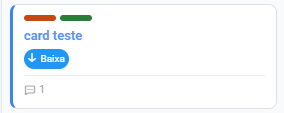

# Rótulos

Rótulos são marcações coloridas que você aplica nos cards para categorizar por tipo, campanha, produto ou qualquer critério do seu processo.

<figure><figcaption></figcaption></figure>

### Criar rótulos

1. Clique em 🔖 **Gerenciar Rótulos** na barra superior do quadro
2. Na seção "Novo rótulo", escolha uma cor e dê um nome
3. Clique em **+**

### Editar e deletar

Na lista de rótulos, clique no nome para editar inline. Use o ícone de lixeira para deletar (o rótulo é removido de todos os cards automaticamente).

### Aplicar no card

Dentro do card aberto, na aba **Detalhes**, clique em **+ Adicionar** na seção Rótulos e escolha da lista.
