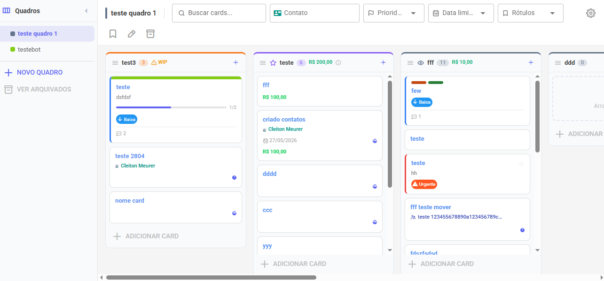

# Visão Geral

O KanbanPro é o sistema de gestão de tarefas e funil de vendas integrado ao Whazing. Com ele você organiza atendimentos, oportunidades e processos em quadros visuais no estilo Kanban — sem precisar sair da plataforma.

<figure><figcaption></figcaption></figure>

### Para que serve?

* **Funil de vendas:** acompanhe cada contato desde o primeiro interesse até o fechamento
* **Gestão de atendimentos:** organize tickets por etapa de resolução
* **Projetos internos:** distribua tarefas entre a equipe com responsáveis e prazos

### Conceitos básicos

Antes de começar, entenda os três pilares do KanbanPro:

| Conceito           | O que é                                                                    |
| ------------------ | -------------------------------------------------------------------------- |
| **Quadro**         | O projeto ou funil em si. Ex: "Vendas 2025", "Suporte Técnico"             |
| **Etapa (Coluna)** | Uma fase do processo. Ex: "Leads", "Em Negociação", "Fechado"              |
| **Card**           | Um item dentro de uma etapa. Representa um contato, tarefa ou oportunidade |
