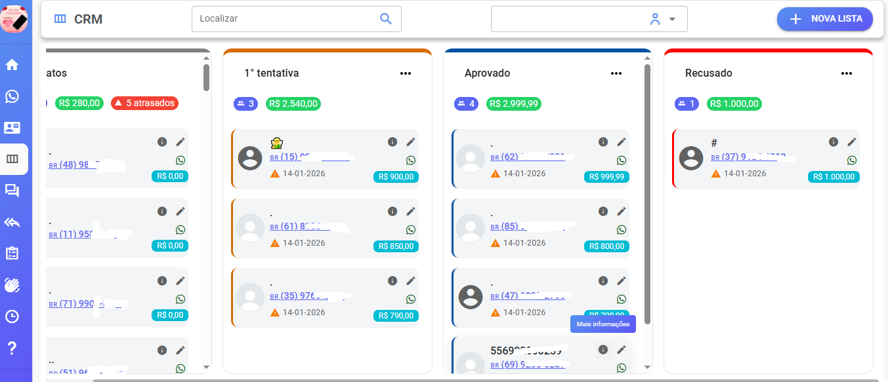
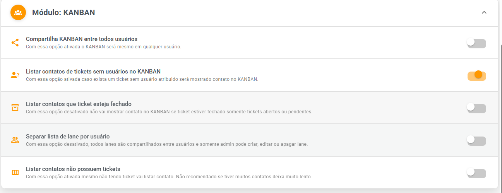
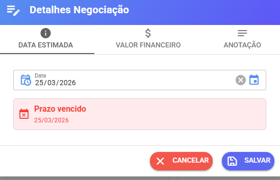

# Kanban

O **Kanban** é uma forma visual de organizar seus atendimentos, como se fosse um quadro com colunas (etapas).

Cada contato vai passando por etapas como:

* Aguardando aprovação
* Aprovado
* Concluído
* (ou qualquer etapa que você criar)

<figure><figcaption></figcaption></figure>

***

## 🧠 Como funciona o Kanban

* Cada **coluna (lane)** representa uma etapa
* Cada **card** representa um contato
* Você pode **arrastar o contato** entre as etapas

***

## 👥 Tipos de Kanban

Existem 2 modos:

#### 🔹 1. Compartilhado (Equipe inteira)

* Todos os usuários veem o mesmo Kanban
* Ideal para equipes

#### 🔹 2. Individual

* Cada usuário tem seu próprio Kanban
* Ideal para uso pessoal

***

## ⚙️ Configurações do Kanban

Vá em:

👉 **Configurações → Configurações**

Aqui você controla como o Kanban funciona:

***

### 🔧 Compartilha KANBAN entre todos usuários

✔ Ativado:

* Todos veem o mesmo Kanban

❌ Desativado:

* Cada usuário tem o seu

***

### 🔧 Listar contatos sem usuário no KANBAN

✔ Mostra contatos sem atendente atribuído

❌ Não mostra

💡 Útil para ver atendimentos “soltos”

***

### 🔧 Separar lista de lanes por usuário

✔ Ativado:

* Cada usuário tem suas próprias colunas

❌ Desativado:

* Colunas são compartilhadas
* Apenas admin pode editar

***

### 🔧 Listar contatos com ticket fechado

✔ Ativado:

* Mostra contatos já finalizados

❌ Desativado:

* Mostra apenas abertos/pendentes

***

### 🔧 Listar contatos sem ticket

✔ Ativado:

* Mostra todos contatos, mesmo sem atendimento

⚠️ Atenção:

* Pode deixar o sistema lento se tiver muitos contatos

<figure><figcaption></figcaption></figure>

***

## 🧾 O que dá pra fazer no Kanban

Dentro de cada contato você pode:

* 📅 Definir data estimada
* 💰 Adicionar valor financeiro
* 📝 Escrever anotações

<figure><figcaption></figcaption></figure>

***

## 🔗 Onde mais posso alterar o Kanban

Você também pode mudar a etapa do contato em:

* Tela de atendimento
* Tela de edição do contato

<figure><figcaption></figcaption></figure>

***

## 🔍 Filtros

Você pode filtrar contatos em alguns módulos e relatórios do sistema por etapa (lane):

👉 Exemplo:

* Ver só "Aprovados"
* Ver só "Aguardando"

***

## 📌 Importante

* O Kanban respeita regras da **carteira de atendimento**
* Nem todos contatos aparecem dependendo das configurações

***

## 🤖 Automação (Avançado)

⚠️ Funciona **somente com Kanban compartilhado ativado**

Você pode mover contatos automaticamente usando:

* API
* Typebot
* Bot interno
* Recepção inteligente

***

## 🔹 TYPEBOT (Mover contato automaticamente)

Adicione este comando no fluxo:

```
#{ "crmId": "1" }
```

👉 Troque o **1** pelo ID da coluna (lane)

***

## 🔹 API (Mover contato via sistema externo)

Endpoint:

```
POST /updatecrm
```

***

### 📲 Por número

```json
{
  "number": "5511999999999",
  "crm": 1
}
```

***

### 👤 Por contactId

```json
{
  "contactId": 3397,
  "crm": 8
}
```

***

### 🎫 Por ticketId

```json
{
  "ticketId": 2881,
  "crm": 19
}
```

***

### ❌ Remover do Kanban

Use:

```json
{
  "crm": 0
}
```

***

## ✅ Resumo rápido

* Kanban = organização visual dos atendimentos
* Pode ser individual ou compartilhado
* Dá pra automatizar via bot/API
* Evite listar contatos sem ticket (pode travar sistema)
