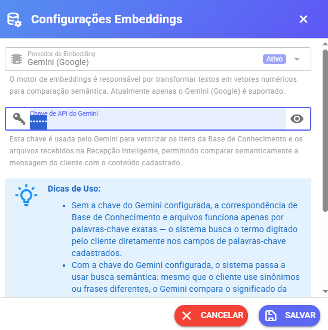

# Base de Conhecimento

## 📚 Base de Conhecimento para Reduzir Prompt e Tokens

Para deixar o prompt:

* ✅ Mais simples
* ✅ Menor
* ✅ Mais estável
* ✅ Com menor consumo de tokens

Você pode utilizar a **Base de Conhecimento** integrada à Recepção Inteligente.

Assim, a IA só recebe informações extras **quando necessário**, em vez de manter tudo fixo no prompt principal.

***

## 🎯 Qual o objetivo?

Evitar prompts longos que podem:

* Confundir a IA
* Aumentar consumo de tokens
* Gerar respostas inconsistentes
* “Fazer a IA enlouquecer” 😅

Com a Base de Conhecimento:

* O prompt principal fica enxuto
* Informações específicas são adicionadas apenas quando a palavra-chave é detectada

***

## 🛠️ Como Funciona na Prática

#### 1️⃣ Criar uma Base de Conhecimento

Exemplo:

Criar base chamada:

```
IXC
```

Dentro dela, você cadastra:

* Como configurar IXC
* Passo a passo
* Requisitos
* Links importantes
* Informações técnicas

***

#### 2️⃣ Configurar na Recepção Inteligente

Na configuração:

* Selecione a base criada
* Defina a palavra-chave:

```
ixc
```

***

#### 3️⃣ O que acontece quando o cliente falar “ixc”?

Se o cliente escrever algo como:

> “Como configurar o IXC?”

O sistema automaticamente:

* Detecta a palavra-chave
* Injeta o conteúdo da base no prompt da IA
* Envia junto com as instruções

***

## 🧠 Modelo Padrão de Injeção da Base

Quando ativada, o sistema adiciona ao prompt algo como:

```
━━━━━━━━━━━━━━━━━━━━━━━━━━━━━━━━━━
📚 BASE DE CONHECIMENTO ATIVADA
━━━━━━━━━━━━━━━━━━━━━━━━━━━━━━━━━━

As seguintes informações foram encontradas na base de conhecimento e devem ser usadas para responder:

${content}

━━━━━━━━━━━━━━━━━━━━━━━━━━━━━━━━━━
⚠️ INSTRUÇÕES
━━━━━━━━━━━━━━━━━━━━━━━━━━━━━━━━━━

1. USE as informações acima como fonte primária
2. Siga os passos EXATAMENTE como descritos
3. Seja natural - NÃO mencione "consultei a base de conhecimento"
4. Se precisar de mais informações além do que está acima, seja honesto
5. NÃO invente - use APENAS o que foi fornecido
━━━━━━━━━━━━━━━━━━━━━━━━━━━━━━━━━━
```

A variável:

```
${content}
```

Contém exatamente o texto salvo na Base de Conhecimento.

***

## ✏️ Personalizando o Próprio Prompt

Você também pode criar seu próprio modelo de injeção.

⚠️ Importante:\
Sempre inclua a variável:

```
{content}
```

Ela é responsável por inserir o conteúdo da Base de Conhecimento dentro do prompt.

Se esquecer essa variável, a IA não receberá o conteúdo.

***

Aqui está **somente o conteúdo que você deve acrescentar na documentação** 👇

***

### 🔎 Busca Avançada com IA (Vector / Semântica)

Agora a Base de Conhecimento conta com **busca inteligente por similaridade**, permitindo encontrar conteúdos mesmo quando o cliente não usa exatamente a palavra-chave.

Também é possível **enviar arquivos (PDF, DOC, etc)** para serem usados como fonte de conhecimento.

***

### 🤖 Como funciona

O sistema pode utilizar o **Gemini (Google)** para transformar textos em vetores (embeddings), permitindo comparação por significado (semântica), e não apenas por palavras exatas.

***

### 🔑 Configuração da API do Gemini

***

### ⚠️ Importante

Para ativar a busca inteligente, configure a **API Key do Gemini** nas configurações da **Base de Conhecimento**.

* A mesma chave é utilizada para:
  * Base de Conhecimento
  * Correspondência de Arquivos

Sem essa configuração:

* A busca funciona apenas por palavras-chave exatas
* A busca semântica (por similaridade) não será ativada

***

Essa chave permite:

* Comparar mensagens por **significado**, não só palavras
* Encontrar respostas mesmo com **sinônimos ou frases diferentes**
* Analisar conteúdo de **arquivos enviados pelo cliente**
* Melhorar muito a precisão das respostas

<figure><figcaption></figcaption></figure>

***

### ⚠️ Sem a API do Gemini

Se a chave não estiver configurada:

* A busca funciona apenas por **palavras-chave exatas**
* O sistema procura exatamente o termo digitado pelo cliente
* Arquivos não são analisados por conteúdo, apenas por nome ou palavras-chave

***

### 📄 Suporte a Arquivos

Agora você pode adicionar arquivos como fonte de conhecimento:

* PDF
* DOC / DOCX
* Textos em geral

Com o Gemini ativo:

* O conteúdo dos arquivos é lido e indexado
* A IA consegue buscar informações **dentro dos arquivos**
* Funciona até com perguntas indiretas

***

### ⚙️ Estratégia de Busca

Define como o sistema encontra informações na Base:

* **somente palavras chaves**\
  Busca por palavra exata (modo tradicional)
* **palavras chaves + busca vetorial** (recomendado)\
  Primeiro filtra por palavra-chave, depois refina por similaridade

***

### 🎯 Similaridade

Define o quão parecida a mensagem precisa ser para retornar um resultado.

Valor entre **0 e 1**:

* **0.70** → equilíbrio ideal (recomendado)
* **0.85** → muito restrito (resultados quase idênticos)
* **0.50** → mais aberto (pode trazer conteúdos menos relevantes)

***

### 📊 Máximo resultados

Define quantos itens da Base de Conhecimento serão enviados para a IA por mensagem.

💡 Recomendado: entre **2 e 4**

* Valores altos podem:
  * Aumentar consumo de tokens
  * Deixar o prompt mais pesado
  * Reduzir performance

***

### 🚀 Resultado

Com essa configuração:

* A IA entende melhor o cliente, mesmo sem palavras exatas
* Conteúdos de arquivos também são utilizados
* Respostas ficam mais precisas e inteligentes
* Mantém o sistema otimizado e eficiente

***

## 🚀 Vantagens

* 🔥 Reduz consumo de tokens
* 🧠 Melhora precisão das respostas
* 📚 Organiza conteúdos técnicos
* ⚡ Deixa o prompt principal mais leve
* 🎯 Ativa informação apenas quando necessário

***

## ✅ Resultado Final

Com essa configuração:

1. Cliente menciona palavra-chave
2. Sistema injeta automaticamente o conteúdo relacionado
3. IA responde com base correta
4. Prompt permanece limpo e otimizado

Isso torna o atendimento **mais inteligente, econômico e estável** 🚀
