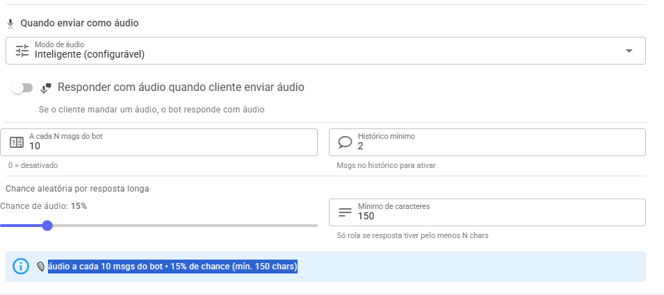

# Configuração de Resposta por Áudio

Agora o sistema pode responder seus clientes com **áudio automático**, deixando o atendimento mais humano e dinâmico.

A funcionalidade utiliza o serviço da **ElevenLabs** para gerar voz.

👉 Para usar, você precisa de uma API Key:\
[https://elevenlabs.io/app/developers/api-keys](https://elevenlabs.io/app/developers/api-keys)

***

### ⚙️ Como funciona

Você pode escolher diferentes formas de resposta por áudio:

<figure><figcaption></figcaption></figure>

#### 🔁 Sempre em Áudio

Todas as mensagens do sistema serão respondidas em áudio.

***

#### 🧠 Modo Inteligente

O sistema decide quando enviar áudio, com base nas configurações abaixo:

* **Responder com áudio quando o cliente enviar áudio**\
  Se o cliente mandar um áudio, o sistema responde em áudio automaticamente.
* **Áudio a cada X mensagens do bot**\
  Define de quanto em quanto tempo o sistema envia uma resposta em áudio.
* **Histórico mínimo de mensagens**\
  Quantidade mínima de mensagens antes de começar a usar áudio.
* **Chance de enviar áudio (%)**\
  Define a probabilidade de uma mensagem ser enviada em áudio.
* **Quantidade mínima de caracteres**\
  Só envia áudio se a mensagem tiver um tamanho mínimo.

***

### 📊 Resumo da Configuração

O sistema mostra um resumo automático da sua configuração.

💡 Exemplo:

> "Áudio a cada 10 mensagens do bot • 15% de chance (mín. 150 caracteres)"

***

### 💡 Dica

Use o modo inteligente para evitar excesso de áudios e tornar a conversa mais natural 👍

