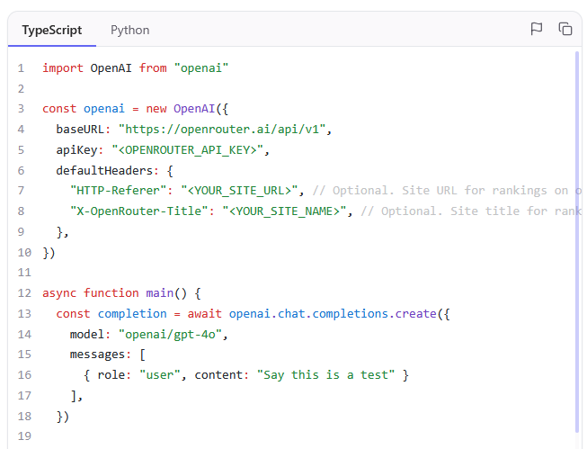
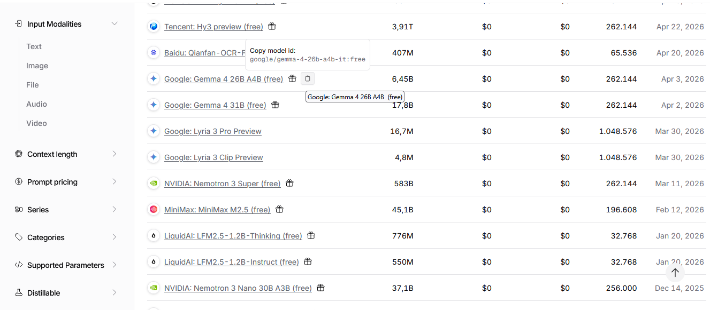
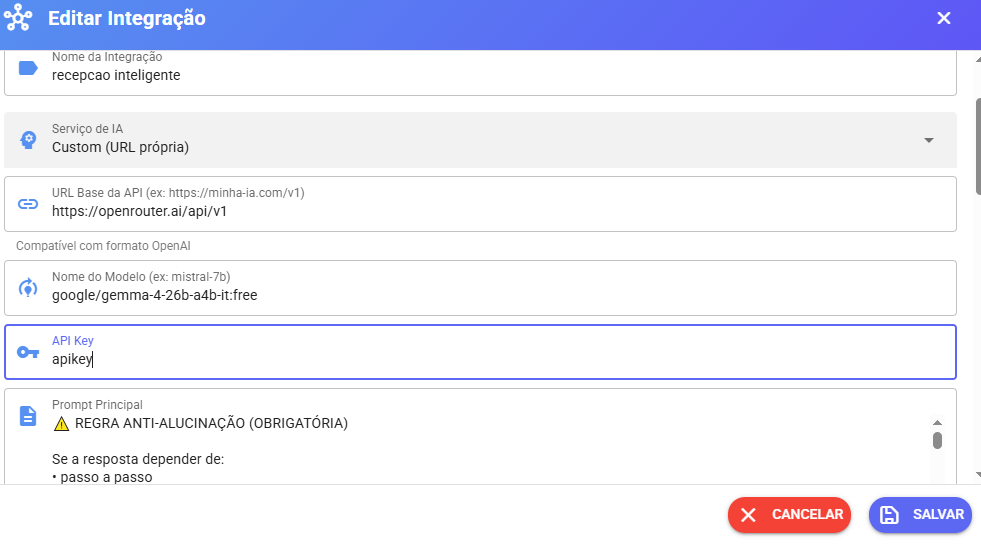

# Configurando Provedor de IA Personalizado (OpenAI Compatível)

A **Recepção Inteligente** permite integrar diferentes provedores de IA usando o padrão compatível com a API da OpenAI.

Isso significa que você não precisa usar apenas os disponíveis no sistema  — é possível utilizar:

* Provedores externos (ex: OpenRouter, etc.)
* Ou até mesmo rodar sua própria IA localmente (ex: Ollama)

***

### ⚠️ Importante (IA local)

Caso você opte por rodar sua própria IA (como com o Ollama), é altamente recomendado:

* Utilizar um **servidor dedicado**
* Ter uma **GPU** (placa de vídeo) para desempenho aceitável
* Não rodar no mesmo servidor do sistema principal (para evitar lentidão)

***

## 🌐 Exemplo prático com OpenRouter

Neste tutorial, vamos usar o OpenRouter como exemplo, pois ele já é compatível com o padrão OpenAI.

***

### 🔎 Passo 1 — Verificar compatibilidade com OpenAI

A primeira coisa é confirmar que o provedor é compatível com OpenAI.

No caso do OpenRouter, isso está documentado aqui:

👉 [https://openrouter.ai/docs/guides/community/openai-sdk](https://openrouter.ai/docs/guides/community/openai-sdk)

✔️ O ponto mais importante é identificar o:

* **Base URL (URL base da API)**

<figure><figcaption></figcaption></figure>

No OpenRouter:

```
https://openrouter.ai/api/v1
```

***

### 🧠 Passo 2 — Escolher o modelo (Model ID)

Agora você precisa escolher qual modelo de IA será utilizado.

Lista de modelos:

👉 [https://openrouter.ai/models](https://openrouter.ai/models)

Exemplos de modelos:

* `openai/gpt-4o`
* `anthropic/claude-3-haiku`
* `mistralai/mistral-7b`

✔️ O valor que você precisa copiar é o **Model ID**

<figure><figcaption></figcaption></figure>

***

### 🔑 Passo 3 — Criar a API Key

Você precisa de uma chave de acesso (API Key).

Crie aqui:

👉 [https://openrouter.ai/workspaces/default/keys](https://openrouter.ai/workspaces/default/keys)

***

### ⚙️ Passo 4 — Configurar no Whazing

Agora vá até a **Recepção Inteligente** no sistema e preencha:

#### Campos:

* **URL Base da API**

```
https://openrouter.ai/api/v1
```

* **Modelo**

```
(ex: openai/gpt-4o)
```

* **API Key**

```
(sua chave gerada no OpenRouter)
```

<figure><figcaption></figcaption></figure>

***

### ✅ Resultado

Após configurar corretamente, a Recepção Inteligente já estará utilizando o provedor de IA escolhido.

***

### 💡 Dicas Extras

* Se der erro:
  * Verifique se a **API Key está correta**
  * Confirme se o **modelo existe**
  * Confira se a **URL base está exata (sem /extra)**
* Nem todos os modelos têm o mesmo custo ou velocidade — teste opções diferentes

