# Wavoip

### 📌 Sobre a integração

A Wavoip permite realizar e receber chamadas diretamente pelo sistema, integrando com WhatsApp.

#### ✔️ Recursos disponíveis:

* Chamadas diretamente pelo atendimento
* Recebimento de ligações
* Gravação de chamadas
* Suporte a múltiplas conexões (tokens e QR Code)
* Compatível com API não oficial e API oficial

***

### 🚀 Passo a Passo

#### 1. Acesse o site da Wavoip

* Entre em: [https://app.wavoip.com/](https://app.wavoip.com/)
* Crie sua conta e faça login

***

#### 2. Adicione um dispositivo

* Após o login, adicione um novo dispositivo
* Escolha entre plano gratuito ou pago

***

### 🔄 3. Conectar o dispositivo

***

1. Copie o token gerado na Wavoip
2. Acesse o sistema (Whazing)
3. Vá até **Canais**
4. Edite o canal desejado
5. Cole o token no campo correspondente
6. Clique em **Salvar**

<figure>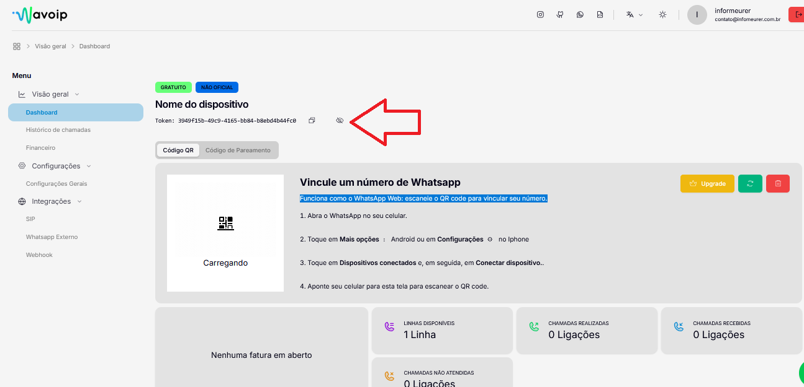<figcaption></figcaption></figure>

<figure>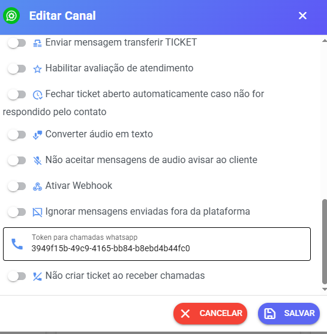<figcaption></figcaption></figure>

Opção whazing ler QR Code wavoip caso necessário fica em ferramentas depois<br>

<figure>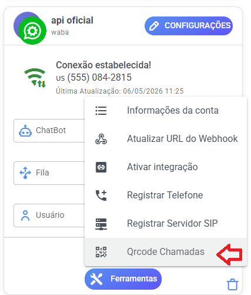<figcaption></figcaption></figure>

Caso tenha somente 1 token já abre nova janela do qrcode e caso tenha mais tokens aparece modal para selecionar o token

<figure>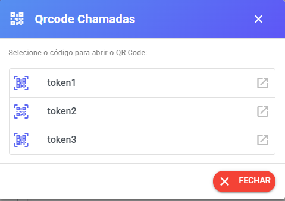<figcaption></figcaption></figure>

***

#### ⚠️ Importante

* Cada conexão (token ou QR Code) funciona como uma sessão separada

***

### 🔑 Múltiplos Tokens (Multi-conexão)

Você pode cadastrar **mais de um token no mesmo canal**.

👉 Basta separar por vírgula:

```
token1,token2,token3
```

***

#### ⚡ Como funciona na prática

* Cada token = 1 conexão independente
* Aumenta a capacidade de ligações simultâneas

**📌 Exemplo:**

* API não oficial permite até **3 ligações simultâneas**
* Você pode usar:
  * 1 QR Code → mensagens (Whazing)
  *
    * 3 tokens → ligações (Wavoip)

***

### 📞 Realizar ligações

1. Abra um atendimento (ticket)
2. Clique no ícone de telefone no topo
3. Inicie a chamada

***

### ☎️ Receber chamadas

Para receber chamadas corretamente:

* Somente usuário tiver permissão acesso chamadas daquele canal

***

### 🔐 Permissão de chamadas API OFICIAL

Para api oficial cliente tem que liberar para poder ligar

#### ✔️ Como funciona:

1. No atendimento, clique em:\
   &#xNAN;**“+” → "Solicitar permissão para chamada"**
2. O cliente recebe a solicitação
3. O sistema recebe um evento quando o cliente autoriza

👉 Somente após autorização será possível realizar a ligação

<figure>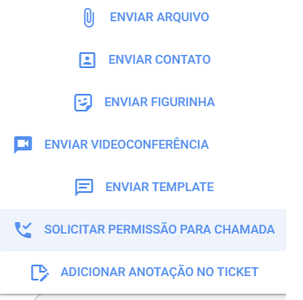<figcaption></figcaption></figure>

<figure>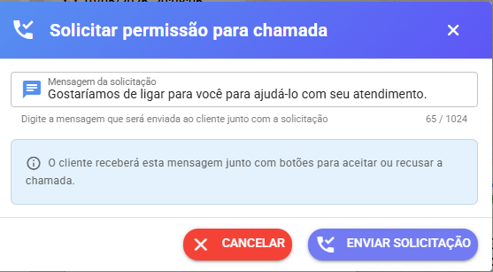<figcaption></figcaption></figure>

<figure>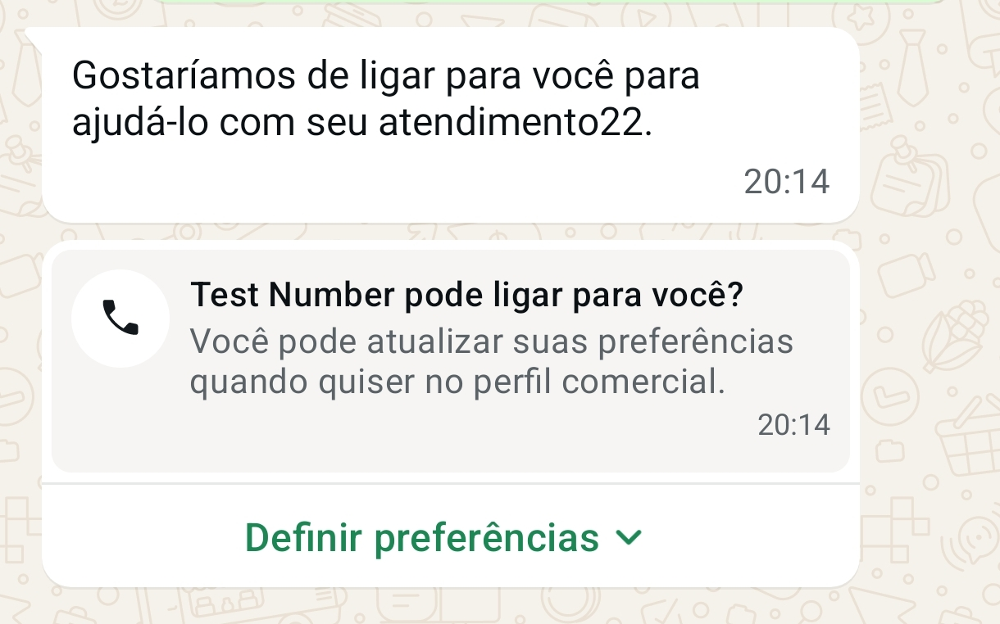<figcaption></figcaption></figure>

<figure>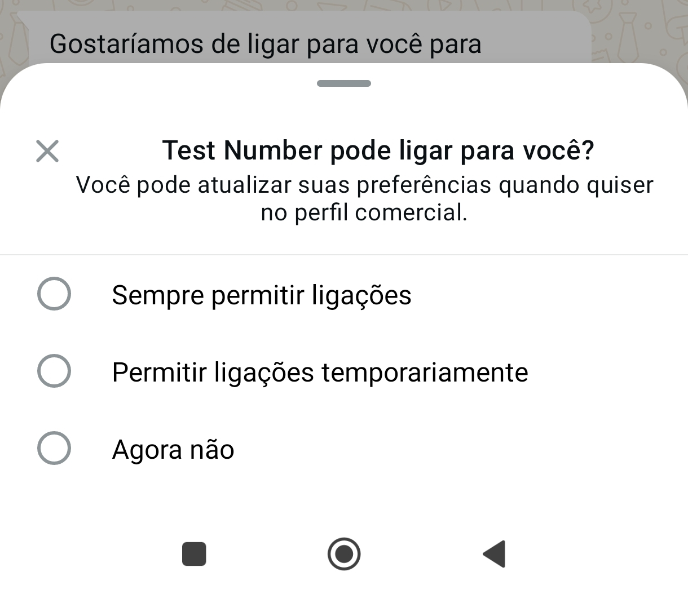<figcaption></figcaption></figure>

Liberar receber ligação do cliente no painel da meta

Acessar [https://business.facebook.com/wa/manage/home/](https://business.facebook.com/wa/manage/home/)

Clicar - Números de telefones - Engrenagem numero que deseja configurar - Mais - Configuração de ligação

<figure>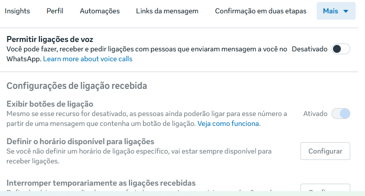<figcaption></figcaption></figure>

Possível definir horários está disponível entre outras configurações

Sobre permissões para ligar quando usuário libera no whazing vai aparecer&#x20;

<figure>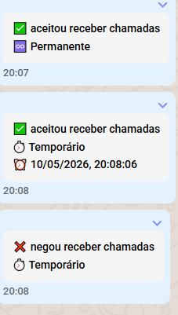<figcaption></figcaption></figure>

***

### ⚠️ Ligações via API Oficial (Meta)

A Wavoip também suporta chamadas via API oficial do WhatsApp.

#### 📌 Requisitos:

* Solicitar liberação com o suporte da Wavoip
* Aprovação necessária
* Não suportado em modo COEX

***

#### 💰 Custos:

* A Meta cobra por minuto de chamada

👉 Consulte valores atualizados:<br>

[https://developers.facebook.com/documentation/business-messaging/whatsapp/calling/pricing](https://developers.facebook.com/documentation/business-messaging/whatsapp/calling/pricing)

***

### 👤 Liberação para usuários

É necessário liberar o canal para os usuários:

1. Acesse o cadastro de usuários
2. Vincule o canal Wavoip ao usuário

<figure>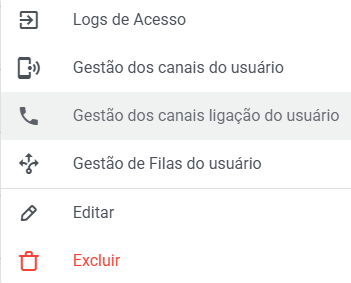<figcaption></figcaption></figure>

<figure>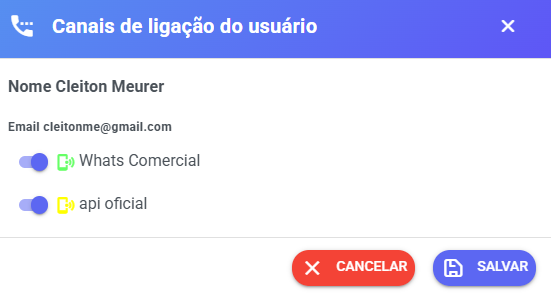<figcaption></figcaption></figure>

Importante após altera permissões deslogar usuário e logar novamente para garantir que permissões sejam atualizadas

***

### 🤝 Parcerias e descontos

Para planos e descontos:

👉 [https://wavoip.com/partners](https://wavoip.com/partners)

***

### 💡 Boas práticas

* Utilize múltiplos tokens para escalar ligações
* Use API não oficial para testes
* Use API oficial para produção (maior estabilidade)
