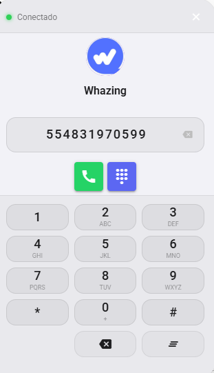
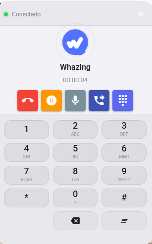
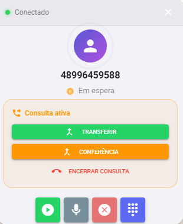
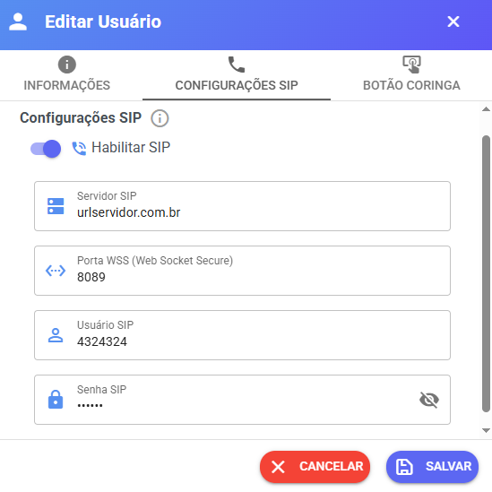
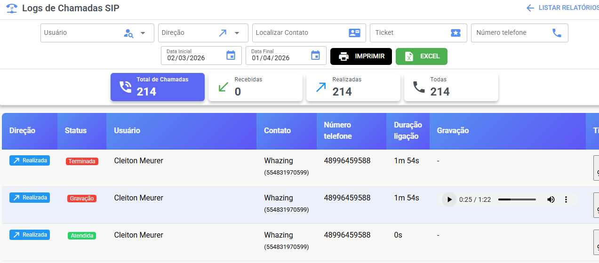

# Discador SIP

Suporte transferência, chamada em espera, gravação das chamadas, conferencia

<figure><figcaption></figcaption></figure>

<figure><figcaption></figcaption></figure>

<figure><figcaption></figcaption></figure>

Para que a integração funcione, seu servidor de telefonia (ex: Asterisk, Issabel) **deve** ter suporte a:

* ✅ **WebRTC**
* ✅ **WSS (Web Socket Secure)**, geralmente operando na porta `8089`.

No cadastro de usuários temos novos campos

<figure><figcaption></figcaption></figure>

Em relatórios é possível encontrar um relatório das chamadas recebidas e efetuadas

<figure><figcaption></figcaption></figure>

Caso precisar de um servidor pode está conversando com:

Jose Felipe Batista Ortiz - 55 34 9772-9922

Hamilton Oliveira Batista - 55 18 99744-1369

Ou verificar nossos parceiros [https://whazing.com.br/parceiros/](https://whazing.com.br/parceiros/)

Sites referencias para testes e documentação ajustes servidor sip.

[https://www.doubango.org/sipml5/expert.htm](https://www.doubango.org/sipml5/expert.htm)

[https://www.odoo.com/pt\_BR/forum/ajuda-1/connect-odoo-to-asterisk-freepbx-252761](https://www.odoo.com/pt_BR/forum/ajuda-1/connect-odoo-to-asterisk-freepbx-252761)
