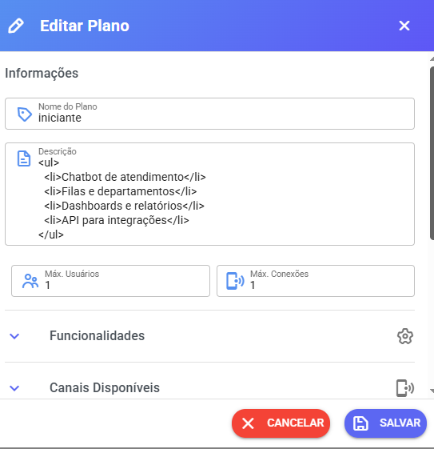
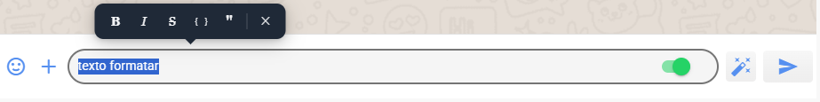

# Criação de Planos - Financeiro

## 1. Acessando o menu de planos

Para criar ou gerenciar planos disponíveis para seus clientes:

1. Acesse o **Painel SaaS**
2. Clique em

**Planos**

3. Clique no botão:

**Adicionar**

<figure><figcaption></figcaption></figure>

***

## 2. Criando um novo plano

Ao clicar em **Adicionar**, será exibido o formulário de criação do plano.

Preencha as seguintes informações:

### Nome do Plano

Nome que será exibido para os clientes.

Exemplos:

* Iniciante
* Profissional
* Empresarial

***

### Descrição plano

Descrição para aparecer cliente tela cadastro ou migração de plano. Aceita algumas personalização HTML, segue alguns exemplos abaixo para cadastro campo

<figure><figcaption></figcaption></figure>

```
<ul>
  <li>Chatbot de atendimento</li>
  <li>Filas e departamentos</li>
  <li>Dashboards e relatórios</li>
  <li>API para integrações</li>
</ul>
```

```
<ul>
  <li>Instagram / Facebook <span class="extra">+R$ 99,90/canal</span></li>
  <li>Chatbot de atendimento</li>
  <li><strong>Botões e Lista</strong> <span class="extra">PLUS +R$ 49,90/canal</span></li>
  <li>Integração <strong>ChatGPT, N8N, Typebot</strong></li>
  <li>Campanhas em massa <span class="extra">opcional +R$ 99,90</span></li>
  <li>Filas e departamentos</li>
  <li>Dashboards e relatórios</li>
  <li>API para integrações</li>
</ul>
```

```
<ul>
  <li>Tudo do plano <strong>Pro</strong> incluído</li>
  <li>Instagram / Facebook <span class="extra">incluso</span></li>
  <li>Campanhas em massa <span class="extra">incluso</span></li>
  <li><strong>Botões e Lista</strong> <span class="extra">incluso</span></li>
  <li>Integração <strong>ChatGPT, N8N, Typebot</strong></li>
  <li>Webchat <span class="extra">incluso</span></li>
  <li>Filas e departamentos</li>
  <li>Dashboards e relatórios</li>
  <li>Suporte prioritário</li>
</ul>
```

***

### Máximo de Usuários

Define **quantos atendentes podem utilizar o sistema** dentro desse plano.

Exemplo:

* 2 usuários
* 5 usuários
* 10 usuários

***

### Máximo de Conexões

Define **quantos números de WhatsApp ou outros canais como facebook e instagram podem ser conectados ao sistema**.

Exemplo:

* 1 conexão
* 3 conexões
* 10 conexões

***

### Valor Mensal

Valor que será cobrado mensalmente do cliente.

Exemplo:

* 49,90
* 99,90
* 199,90

***

## 3. Configurando funcionalidades do plano

Além dos limites de **usuários e conexões**, é possível definir quais funcionalidades estarão disponíveis para os clientes.

### Funcionalidades disponíveis

#### Público

Define se o plano aparecerá na tela de solicitação de teste e migração planos no financeiro

**Quando ativado:**

* O plano aparece na lista de planos disponíveis
* Pode ser usado para **teste automático e na migração**

**Quando desativado:**

* Plano fica **oculto**
* Uso **somente interno**

***

#### Grupos

Permite acesso a **grupos do WhatsApp**.

Se desativado, o cliente não poderá utilizar grupos.

***

#### Campanhas

Permite envio de **campanhas em massa**.

Se desativado, o cliente não terá acesso opção campanha

***

#### Integrações

Permite cadastrar integrações externas.

Exemplos:

* Webhooks
* N8N
* Typebot
* Outras automações

***

#### Importar Mensagens

Permite **importar mensagens antigas do WhatsApp**.

Essa função aparece quando o cliente **conecta o WhatsApp lendo o QR Code ou sincronização mensagem plus e WuzApi**.

<figure><figcaption></figcaption></figure>

***

## 4. Vinculando plano a uma empresa

Após criar o plano, ele pode ser associado a uma empresa.

Para isso:

1. Acesse no painel SaaS menu:

**Empresas**

2. Edite a empresa desejada
3. No campo **Plano**, selecione o plano criado.

<figure><figcaption></figcaption></figure>

***

## 5. Cobranças automáticas

O sistema gera automaticamente as cobranças.

### Como funciona

As cobranças:

* São geradas **automaticamente**
* Aparecem na área **Financeiro** do cliente
* São criadas **20 dias antes do vencimento**

<figure><figcaption></figcaption></figure>

***

### Importante

Se você:

* apagar uma cobrança
* alterar o plano do cliente

O sistema **irá gerar novamente as cobranças automaticamente**.

Basta aguardar.

***

## 6. Períodos de cobrança

Atualmente o sistema suporta:

✔ Cobrança **mensal, bimestral, trimestral, semestral e anual**

Ainda **não possui suporte para:**

* assinatura automática

***

## 7. Baixa automática de pagamentos

Para que pagamentos sejam baixados automaticamente no sistema, é necessário configurar **webhook do gateway de pagamento**.

Cada gateway possui sua própria configuração.

Consulte a documentação correspondente.

***

## 8. Baixa manual de faturas

Caso necessário, também é possível:

* dar **baixa manual**
* **excluir faturas**

Para isso:

1. Acesse **Empresas**
2. Clique em **Ações**
3. Acesse a área **Listar Faturar em Aberto**

<figure><figcaption></figcaption></figure>

***

## Conclusão

Agora você já sabe:

✔ Criar planos\
✔ Definir limites de usuários e conexões\
✔ Configurar funcionalidades\
✔ Associar planos a empresas\
✔ Entender como funcionam as cobranças

***

✅ Isso permite criar **diferentes níveis de plano para seus clientes**, organizando recursos e limites dentro do sistema.
